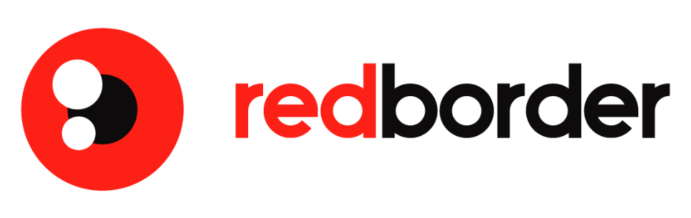
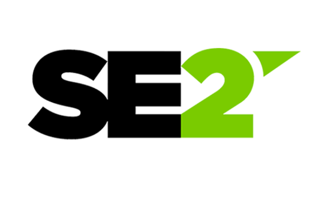

<!--
 * Copyright (c) 2019, WSO2 Inc. (http://www.wso2.org) All Rights Reserved.
 *
 * WSO2 Inc. licenses this file to you under the Apache License,
 * Version 2.0 (the "License"); you may not use this file except
 * in compliance with the License.
 * You may obtain a copy of the License at
 *
 * http://www.apache.org/licenses/LICENSE-2.0
 *
 * Unless required by applicable law or agreed to in writing,
 * software distributed under the License is distributed on an
 * "AS IS" BASIS, WITHOUT WARRANTIES OR CONDITIONS OF ANY
 * KIND, either express or implied. See the License for the
 * specific language governing permissions and limitations
 * under the License.
-->

<h1>Siddhi</h1>

Fully open source, cloud native, scalable, <b>micro streaming</b>, and complex event processing system capable of building event-driven applications for real-time analytics, data integration, notification, and adaptive decision-making use cases.

Event processing logic can be written using Streaming SQL queries via Siddhi graphical and source editor, to capture events from diverse data sources, process and analyze events, integrate with multiple services and data stores, and publish output to various endpoints in real-time. 

<!-- <a href="#" class="cDownloadButton">Download</a> -->

<h3>Distributions</h3>

<ui>
<li><a class="cDistribution cKubernetes" href="en/_latest_version_/download/#siddhi-kubernetes">Kubernetes</a></li>
<li><a class="cDistribution cDocker" href="en/_latest_version_/download/#siddhi-docker">Docker</a></li>
<li><a class="cDistribution cVM" href="en/_latest_version_/download/#siddhi-distribution">VM (Binary)</a></li>
<li><a class="cDistribution cJava" href="en/_latest_version_/download/#siddhi-libs">Java</a></li>
<li><a class="cDistribution cPython" href="https://siddhi-io.github.io/PySiddhi/">Python</a></li>
<li><a class="cDistribution cSource" href="en/_latest_version_/development/source/">Source</a></li>
</ui>

<a class="terminalLink" href="https://www.katacoda.com/siddhi/scenarios/siddhi-editor" target="_blank">Try in playground  <i class="fas fa-external-link-alt"></i></a>

<asciinema-player src="images/siddhi-510-on-k8s.cast" autoplay="true" loop="true" speed="3" preload="true" cols="62" rows="16"></asciinema-player>

<ul  class="cDemoControls">
    <li class="active"><a  href="#1a" data-toggle="tab">Siddhi Editor</a>
	</li>
	<li><a href="#2a" data-toggle="tab">Siddhi on Kubernetes</a>
	</li>
</ul>

<a class="cTryIt cExample" target="_blank" href="en/_latest_version_/docs/examples/">Learn Siddhi by Examples</a>
<a class="cTryIt cKatacoda" target="_blank" href="https://www.katacoda.com/siddhi">Try in Katacoda</a>

<h2>Benefits</h2>

<h3>Faster Development</h3>

Agile development experience with SQL like query language and graphical drag-and-drop editor supporting event simulation.

<h3>Cloud Native</h3>

Lightweight runtime that natively runs in Kubernetes via Kubernetes CRD, and works with systems such as NATS, gRPC, and Prometheus.

<h3>Scalable Deployment</h3>

Embedded event processing within Java, Python applications to running on bare metal, Docker and massively scaling on Kubernetes.

<h3>System Integration</h3>

Integrates with messaging systems (NATS, Kafka, JMS), Databases (RDBMS, NoSQL), Services (HTTP, gRPC), File systems, E-mail and others.

<h3>CI/CD Pipeline</h3>

Supports development lifecycle and seamless deployments, through simple file-based configurations, automated tests, and CI/CD pipelines.

<h3>Reliability</h3>

Battle-tested with billions of events at UBER, eBay, PayPal, HCA, TFL, WSO2 and in many Fortune 500 companies enabling exactly once event processing.

<h2>Overview</h2>

Siddhi can run as an embedded Java or Python library, run as a microservice on bare-metal, VM, or Docker, and run natively at scale in Kubernetes processing millions of events per second.

<h2>Use cases</h2>

<h3>Streaming Data Integration</h3>
<ul>
    <li><a href="en/_latest_version_/docs/guides/integrate-various-enterprise-systems/guide/" target="_blank">Retrieve and publish data from various enterprise systems. <i class="fas fa-external-link-alt"></i></a></li>
    <li>Perform data transformation on JSON, XML, Text, Avro, and CSV.</li>
    <li>Integrate with databases, services, and realtime event streams.</li>
    <li><a href="en/_latest_version_/docs/guides/fault-tolerance/guide/" target="_blank">Data preprocessing, fault tolerance, and error handling. <i class="fas fa-external-link-alt"></i></a></li>
</ul>

<h3>Streaming Data Analytics</h3>
<ul>
    <li>Calculate aggregations over time, length, and session windows.</li>
    <li><a href="en/_latest_version_/docs/guides/long-term-aggregation/guide/" target="_blank">Long-running time-series aggregations from seconds to years. <i class="fas fa-external-link-alt"></i></a></li>
    <li><a href="en/_latest_version_/docs/guides/patterns-and-trends/guide/" target="_blank">Analyze event occurrence patterns and trends over time. <i class="fas fa-external-link-alt"></i></a></li>
    <li><a href="en/_latest_version_/docs/guides/realtime-movie-recommendation/guide/" target="_blank">Realtime predictions with online and pre-trained ML models. <i class="fas fa-external-link-alt"></i></a></li>
</ul>

<h3>Alerts & Notifications</h3>
<ul>
    <li><a href="en/_latest_version_/docs/guides/alerts-for-thresholds/guide/" target="_blank">Generate alerts based on static and dynamic thresholds. <i class="fas fa-external-link-alt"></i></a></li>
    <li>Correlate data to detect event anomalies and missing events.</li>
    <li>Support scheduling, digest, and auto-retry of notifications.</li>
    <li>Publish alerts via various event sinks such as email, and MQs.</li>
</li>
</ul>

<h3>Adaptive Decision Making</h3>
<ul>
    <li><a href="en/_latest_version_/docs/guides/database-static-rule-processing/guide/" target="_blank">Static rule processing via predefined and database based rules. <i class="fas fa-external-link-alt"></i></a></li>
    <li>Dynamic rule processing through stateful queries and system state.</li>
    <li>Decision making through synchronous RPC (HTTP, gRPC).</li>
    <li>Incremental learning and decision making online ML models.</li>
</ul>

<h2>Who Uses Siddhi</h2>

<h2>Try Siddhi</h2>
<ul>
    <li><h3><a href="en/_latest_version_/download/"><i class="fas fa-download iconsForList"></i> Download</a></h3></li>
    <li><h3><a href="en/_latest_version_/docs/quick-start/"><i class="far fa-play-circle iconsForList"></i> Getting started</a></h3></li>
    <li><h3><a href="en/_latest_version_/docs/query-guide/"><i class="fas fa-info-circle iconsForList"></i> Siddhi query guide</a></h3></li>
    <li><h3><a href="en/_latest_version_/development/architecture/"><i class="fas fa-project-diagram iconsForList"></i> Architecture</a></h3></li>
    <li><h3 class="cLinks__last"><a href="en/_latest_version_/docs/siddhi-as-a-kubernetes-microservice/"><i class="fas fa-question-circle iconsForList"></i> How Siddhi works in Kubernetes</a></h3></li>
</ul>

<h2>Join the Community</h2>
<ul>
    <li><h3><a href="https://github.com/siddhi-io/siddhi/"><i class="fab fa-github iconsForList"></i> Siddhi Core on GitHub</a></h3></li>
    <li><h3><a href="community/#asking-questions"><i class="far fa-envelope iconsForList"></i> Siddhi mailing list</a></h3></li>
    <li><h3><a href="community/contribution/"><i class="fas fa-users iconsForList"></i> How to contribute</a></h3></li>
    <li><h3><a href="en/_latest_version_/development/source/"><i class="fab fa-github iconsForList"></i> Siddhi GitHub repos</a></h3></li>
    <li><h3 class="cLinks__last"><a href="community/#weekly-community-call"><i class="fas fa-phone-alt iconsForList"></i> Weekly community call</a></h3></li>
</ul>

