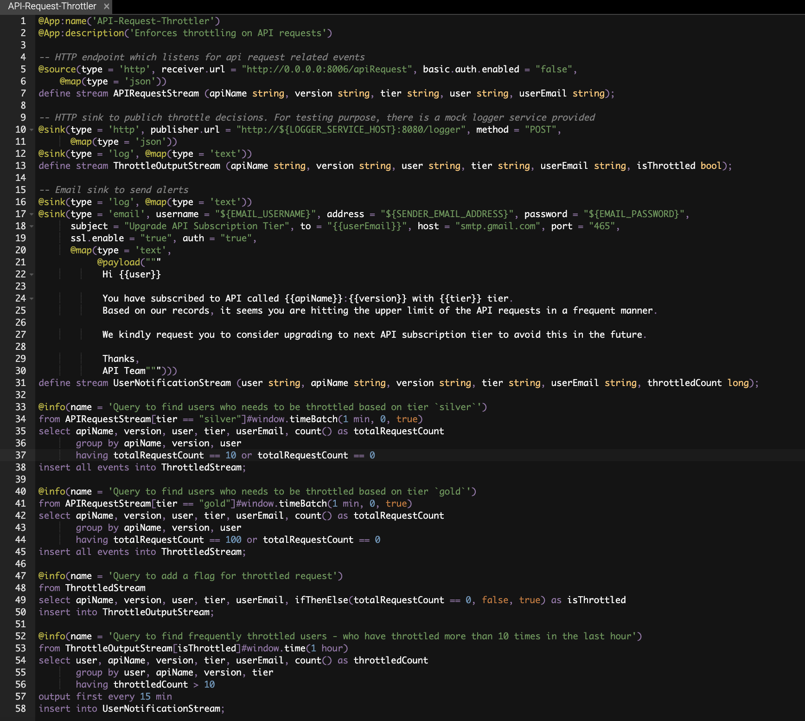
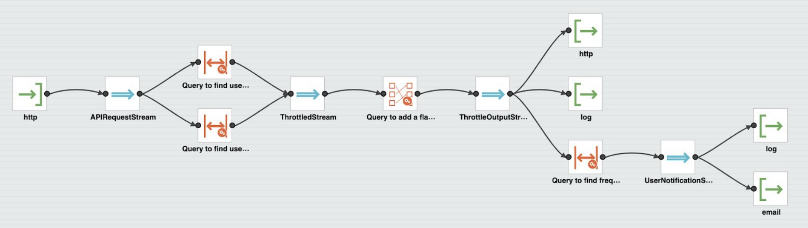
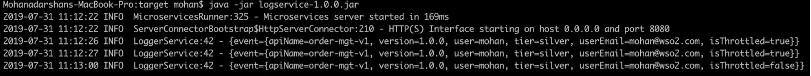
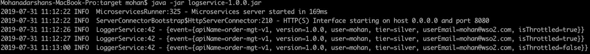
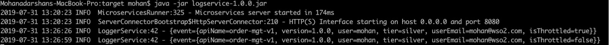
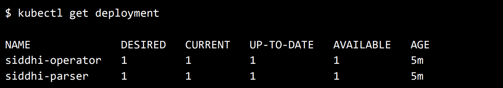
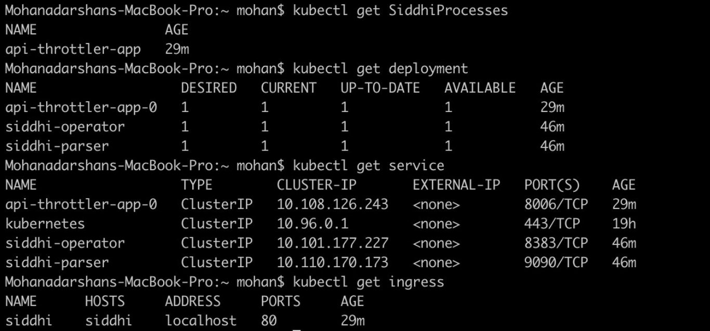
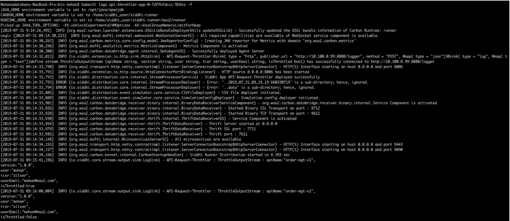

Generating Alerts Based on Static and Dynamic Thresholds
===========================================================

In this guide, you will understand one of the common requirements of a Stream Processing which is generating alerts based on static and dynamic thresholds. To understand this requirement, let’s consider the throttling use case in API management solutions. 

# Scenario - Throttling for API Requests
Throttling has become as one of the unavoidable needs with the evolution of APIs and API management. Throttling is a process that is used to control the usage of APIs by consumers during a given period. 

The following sections are available in this guide.

* [What you'll build](#what-youll-build)
* [Prerequisites](#prerequisites)
* [Implementation](#implementation)
* [Testing](#testing)
* [Deployment & Output](#deployment)

## What you'll build

Let's consider a real world use case to implement the throttling requirement. This will help you to understand some Siddhi Stream Processing constructs such as windows, aggregations, source, and etc. Let’s jump into the use case directly.

Let's assume that you are an API developer and you have published a few APIs to the API store and there are subscribers who have subscribed to these APIs in different tiers which are categorized based on the number of requests per min/sec. If any subscriber is consuming an API more than the allowed quota within a time frame then that specific user will be throttled until that time frame passes. Also if a subscriber is getting throttled often then the system sends a notification to that user requesting to upgrade the tier.

For example, let’s assume that user “John” has subscribed to an API with the tier 'Silver'; silver tier allows a user to make 10 API requests per minute. If John, made more than 10 requests within a minute then his subsequent requests get throttled until the end of the minute, and if he has got throttled more than 10 times in an hour, then he will be notified to upgrade his tier via email.


Now, let’s understand how this could be implemented in Siddhi engine.


## Prerequisites
Below are the prerequisites that should be considered to implement the above use case.

### Mandatory Requirements
* [Siddhi tooling VM/Local distribution](https://siddhi.io/en/v5.1/download/)
* One of the [Siddhi runner distributions](https://siddhi.io/en/v5.1/download/) 
    - VM/Local Runtime
    - Docker Image
    - K8S Operator (commands are given in deployment section)
* Java 8 or higher

### Requirements needed to deploy Siddhi in Docker/Kubernetes

* [Docker](https://docs.docker.com/engine/installation/)
* [Minikube](https://github.com/kubernetes/minikube#installation) or [Google Kubernetes Engine(GKE) Cluster](https://console.cloud.google.com/) or [Docker for Mac](https://docs.docker.com/docker-for-mac/install/)


## Implementation

When a subscriber made an API call to `order-mgt-v1` API it sends an event with the API request information to Siddhi runtime through HTTP transport. 

* Siddhi runtime, keep track of each API request and make decisions to throttle subscribers. 
* Again, once the corresponding time frame passed Siddhi release those throttle users. 
* Throttling decisions are informed to API management solution through an API call.
* If a subscriber is getting throttled more than 10 times in an hour then sends a notification mail once every 15 minutes to that user requesting to upgrade the tier.


### Implement Streaming Queries

1. Start the Siddhi [tolling](https://siddhi.io/en/v5.0/docs/tooling/) runtime and go to the editor UI in http://localhost:9390/editor 

    Follow below steps to start the Siddhi tooling runtime.
    * Extract the downloaded zip and navigate to <TOOLING_HOME>/bin. (TOOLING_HOME refers to the extracted folder) 
    * Issue the following command in the command prompt (Windows) / terminal (Linux/Mac)
        ````
        For Windows: tooling.bat
        For Linux/Mac: ./tooling.sh
        ````

2. Select File -> New option, then you could either use the source view or design view to write/build the Siddhi Application. You can find the Siddhi Application bellow, that implements the requirements mentioned above.

3. Let’s write (develop) the Siddhi Application, as given below.

4. Once the Siddhi app is created, you can use the Event Simulator option in the editor to simulate events to streams and perform developer testing.


````
@App:name('API-Request-Throttler')
@App:description('Enforces throttling on API requests')

-- HTTP endpoint which listens for api request related events
@source(type = 'http', receiver.url = "http://0.0.0.0:8006/apiRequest", basic.auth.enabled = "false", 
	@map(type = 'json'))
define stream APIRequestStream (apiName string, version string, tier string, user string, userEmail string);

-- HTTP sink to publich throttle decisions. For testing purpose, there is a mock logger service provided 
@sink(type = 'http', publisher.url = "http://${LOGGER_SERVICE_HOST}:8080/logger", method = "POST", 
      @map(type = 'json'))
@sink(type = 'log', @map(type = 'text'))
define stream ThrottleOutputStream (apiName string, version string, user string, tier string, userEmail string, isThrottled bool);

-- Email sink to send alerts
@sink(type = 'log', @map(type = 'text'))
@sink(type = 'email', username = "${EMAIL_USERNAME}", address = "${SENDER_EMAIL_ADDRESS}", password = "${EMAIL_PASSWORD}", 
      subject = "Upgrade API Subscription Tier", to = "{{userEmail}}", host = "smtp.gmail.com", port = "465", 
      ssl.enable = "true", auth = "true", 
      @map(type = 'text', 
	       @payload("""
			Hi {{user}}

			You have subscribed to API called {{apiName}}:{{version}} with {{tier}} tier.
			Based on our records, it seems you are hitting the upper limit of the API requests in a frequent manner. 

			We kindly request you to consider upgrading to next API subscription tier to avoid this in the future. 

			Thanks, 
			API Team""")))
define stream UserNotificationStream (user string, apiName string, version string, tier string, userEmail string, throttledCount long);

@info(name = 'Query to find users who needs to be throttled based on tier `silver`')
from APIRequestStream[tier == "silver"]#window.timeBatch(1 min, 0, true) 
select apiName, version, user, tier, userEmail, count() as totalRequestCount 
       group by apiName, version, user 
       having totalRequestCount == 10 or totalRequestCount == 0 
insert all events into ThrottledStream;

@info(name = 'Query to find users who needs to be throttled based on tier `gold`')
from APIRequestStream[tier == "gold"]#window.timeBatch(1 min, 0, true) 
select apiName, version, user, tier, userEmail, count() as totalRequestCount 
       group by apiName, version, user 
       having totalRequestCount == 100 or totalRequestCount == 0 
insert all events into ThrottledStream;

@info(name = 'Query to add a flag for throttled request')
from ThrottledStream 
select apiName, version, user, tier, userEmail, ifThenElse(totalRequestCount == 0, false, true) as isThrottled 
insert into ThrottleOutputStream;

@info(name = 'Query to find frequently throttled users - who have throttled more than 10 times in the last hour')
from ThrottleOutputStream[isThrottled]#window.time(1 hour) 
select user, apiName, version, tier, userEmail, count() as throttledCount 
       group by user, apiName, version, tier 
       having throttledCount > 10 
output first every 15 min 
insert into UserNotificationStream;

````

Source view of the Siddhi app.


Below is the flow diagram of the above Siddhi App.




## Testing

NOTE: In the provided Siddhi app, there are some environmental variables (EMAIL_PASSWORD, EMAIL_USERNAME, and SENDER_EMAIL_ADDRESS) used which are required to be set to send an email alert based on the Siddhi queries defined. Again, there is a mock service configured to receive the throttle decisions, and its host is configured via LOGGER_SERVICE_HOST environment property. Hence, make sure to set the environmental variables with the proper values in the system
        
 * EMAIL_USERNAME: Username of the email account which used to send email alerts. (eg: 'siddhi.gke.user')
 * EMAIL_PASSWORD: Password of the email account which used to send email alerts. (eg: 'siddhi123')
 * SENDER_EMAIL_ADDRESS: Email address of the account used to send email alerts. (eg: 'siddhi.gke.user@gmail.com')
 * LOGGER_SERVICE_HOST: IP address of the host where logger service is running. (eg: 'localhost')

When you run the Siddhi app in the editor, you will see below logs getting printed in the editor console.


- You could simply simulate some events directly into the stream and test your Siddhi app in the editor itself. 
- Then, you can also simulate some events through HTTP to test the application. The following sections explain how you can test the Siddhi app via HTTP using cURL. 

### Run Mock Logger service

In the provided Siddhi app, there is an HTTP sink configured to push output events to an HTTP endpoint of the API Manager. For simplicity, you will be mocking this service. Please download the mock server [jar](https://github.com/mohanvive/siddhi-mock-services/releases/download/v1.0.0/logservice-1.0.0.jar) and run that mock service by executing the following command.

````
java -jar logservice-1.0.0.jar
````

### Invoking the Siddhi App

As per the Siddhi app that you wrote in the 'Implementation' section, there is an HTTP service running in Siddhi which is listening for events related to API requests. The respective service can be accessed via the URL  `http://localhost:9090/ThotttleService`. 

As per the app, the API request will get throttled if there are more than 10 requests by the same user, to the same API (for 'silver’ tier).

````
curl -v -X POST -d '{ "event": { "apiName": "order-mgt-v1", "version": "1.0.0", "tier":"silver","user":"mohan", "userEmail":"example@wso2.com"}}' "http://localhost:8006/apiRequest" -H "Content-Type:application/json"
````

If you invoke the above cURL request for more than 10 times within a minute, then Siddhi starts throttling the request, and sends an alert to the API Manager (logservice), while logging the alert as below.

````
INFO {io.siddhi.core.stream.output.sink.LogSink} - API-Request-Throttler :
ThrottleOutputStream : Event{timestamp=1564056341280, data=[order-mgt-v1, 1.0.0,
mohan, silver, true], isExpired=false}
````

You can validate that the alert has reached the API Manager (logservice) from its console logs.



If a user gets throttled more than 10 times within an hour then Siddhi sends an email to the respective user. 

Note: The configurations provided in the email sink along with the environment properties will work for Gmail, but if you use other mail servers, please make sure to change the config values accordingly.


## Deployment

Once you are done with the development, export the Siddhi app that you have developed with 'File' -> 'Export File' option.

You can deploy the Siddhi app using any of the methods listed below. 

### Deploy on VM/ Bare Metal

1. Download the latest Siddhi Runner [distribution](https://github.com/siddhi-io/distribution/releases/download/v0.1.0/siddhi-runner-0.1.0.zip).
2. Unzip the `siddhi-runner-x.x.x.zip`.
3. Configure the necessary environmental variables

   In the above provided Siddhi app, there are some environmental variables (EMAIL_USERNAME, EMAIL_PASSWORD, and SENDER_EMAIL_ADDRESS) which are required to be set to send email alerts based on the Siddhi queries defined. Again, there is a mock service configured to receive the throttle decisions (instructions given below), and its host is configured via LOGGER_SERVICE_HOST environment property. 
    Hence, make sure to set the environmental variables with the proper values in the system (make sure to follow necessary steps based on the underneath operating system).  
    
4. Start Siddhi app with the runner config by executing the following commands from the distribution directory.
        
     ```
     Linux/Mac : ./bin/runner.sh -Dapps=<siddhi-file-path> 
     Windows : bin\runner.bat -Dapps=<siddhi-file-path>

	    Eg: If exported siddhi app in Siddhi home directory,
            ./bin/runner.sh -Dapps=API-Request-Throttler.siddhi
      ```
    
5. Download the mock [logging service](https://github.com/mohanvive/siddhi-mock-services/releases/download/v1.0.0/logservice-1.0.0.jar) which is used to demonstrate the capability of Siddhi HTTP sink. Execute the below command to run the mock server.

	    java -jar logservice-1.0.0.jar

6. Invoke the apiRequest service with the following cURL request for more than 10 times within a minute time period. Please make sure to change the `userEmail` property value to an email address that you could use to test the email alerting purposes.

        curl -v -X POST -d '{ "event": { "apiName": "order-mgt-v1", "version": "1.0.0", "tier": "silver", "user":"mohan", "userEmail":"example@wso2.com"}}' "http://localhost:8006/apiRequest" -H "Content-Type:application/json"

7. You can see the output log in the console. Here, you will be able to see the alert log printed as shown below.

     

8. At the same time, you could also see the events received to HTTP mock service endpoint (started in step #5) via its log as below.

      

### Deploy on Docker

1. Create a folder locally on your host machine (eg: `/home/siddhi-apps`) and copy the Siddhi app into it.

2. Pull the latest Siddhi Runner image from [Siddhiio Docker Hub] (https://hub.docker.com/u/siddhiio).
    
    ````
    docker pull siddhiio/siddhi-runner-alpine:5.1.0-m1
    ````

3. Start SiddhiApp by executing the following docker command.

    ````
    docker run -it -p 8006:8006 -v /home/siddhi-apps:/apps -e EMAIL_PASSWORD=siddhi123 -e EMAIL_USERNAME=siddhi.gke.user -e SENDER_EMAIL_ADDRESS=siddhi.gke.user@gmail.com -e LOGGER_SERVICE_HOST=10.100.0.99 siddhiio/siddhi-runner-alpine:5.1.0-m1 -Dapps=/apps/API-Request-Throttler.siddhi
    ````

    NOTE: In the above provided Siddhi app, there are some environmental variables (EMAIL_PASSWORD, EMAIL_USERNAME, and SENDER_EMAIL_ADDRESS) which are required to be set to send email alerts based on the Siddhi queries defined. Again, there is a mock service configured to receive the throttle decisions (instructions given below), and its host is configured via LOGGER_SERVICE_HOST environment property. 
    Hence, make sure to add proper values for the environmental variables in the above command.

4. Download the mock [logging service](https://github.com/mohanvive/siddhi-mock-services/releases/download/v1.0.0/logservice-1.0.0.jar) which is used to demonstrate the capability of Siddhi HTTP sink. Execute the below command to run the mock server.

    ````
	    java -jar logservice-1.0.0.jar
	````

5. Invoke the apiRequest service with the following cURL request for more than 10 times within a minute time period. Please make sure to change the `userEmail` property value to an email address that you could use to test the email alerting purposes.

    ````
        curl -v -X POST -d '{ "event": { "apiName": "order-mgt-v1", "version": "1.0.0", "tier": "silver", "user":"mohan", "userEmail":"example@wso2.com"}}' "http://localhost:8006/apiRequest" -H "Content-Type:application/json"
    ````
        
6. Since you have started the docker in interactive mode you can see the output in its console as below. 
(If it is not started in the interactive mode then you can run `docker exec -it  <docker-container-id> sh` command, go into the container and check the log file in `home/siddhi_user/siddhi-runner/wso2/runner/logs/carbon.log` file)

    

7. At the same time, you could also see the events received to HTTP mock service endpoint (started in step #4) via its log as below.

    
    
8. If there are more than 10 requests get throttled within 1 hour then the API invoker will receive an email (as shown in the 'Testing' section).


### Deploy on Kubernetes
1. Install Siddhi Operator
    - To install the Siddhi Kubernetes operator run the following commands.
        
        ````
        kubectl apply -f https://github.com/siddhi-io/siddhi-operator/releases/download/v0.2.0-m1/00-prereqs.yaml
        kubectl apply -f https://github.com/siddhi-io/siddhi-operator/releases/download/v0.2.0-m1/01-siddhi-operator.yaml
        ````
        
     - You can verify the installation by making sure the following deployments are running in your Kubernetes cluster.
     
        


2. Download the mock [logging service](https://github.com/mohanvive/siddhi-mock-services/releases/download/v1.0.0/logservice-1.0.0.jar) 
which is used to demonstrate the capability of Siddhi HTTP sink. Execute the below command to run the mock server.

    ````
        java -jar logservice-1.0.0.jar
    ````
    
3. Siddhi applications can be deployed on Kubernetes using the Siddhi operator.
    - Before deploying the apps you have to define an [Ingress](https://kubernetes.github.io/ingress-nginx/deploy/#provider-specific-steps), this is because there is an HTTP endpoint in the Siddhi app you have written and you will be sending events to that.

    - To deploy the above created Siddhi app, you have to create a custom resource object YAML file (with the kind as SiddhiProcess) as following
    
        ````
        apiVersion: siddhi.io/v1alpha2
        kind: SiddhiProcess
        metadata:
          name: api-throttler-app
        spec:
          apps:
           - script: |
                @App:name('API-Request-Throttler')
                @App:description('Enforcesthrottling to API requests ')
        
                -- HTTP endpoint which listens for api request related events
                @source(type = 'http', receiver.url = "http://0.0.0.0:8006/apiRequest", basic.auth.enabled = "false", 
                    @map(type = 'json'))
                define stream APIRequestStream (apiName string, version string, tier string, user string, userEmail string);
        
                -- HTTP sink to publich throttle decisions. For testing purpose, there is a mock logger service provided 
                @sink(type = 'http', publisher.url = "http://${LOGGER_SERVICE_HOST}:8080/logger", method = "POST", 
                    @map(type = 'json'))
                @sink(type = 'log', @map(type = 'text'))
                define stream ThrottleOutputStream (apiName string, version string, user string, tier string, userEmail string, isThrottled bool);
        
                -- Email sink to send alerts
                @sink(type = 'log', @map(type = 'text'))
                @sink(type = 'email', username = "${EMAIL_USERNAME}", address = "${SENDER_EMAIL_ADDRESS}", password = "${EMAIL_PASSWORD}", 
                subject = "Upgrade API Subscription Tier", to = "{{userEmail}}", host = "smtp.gmail.com", port = "465", ssl.enable = "true", auth = "true", 
                    @map(type = 'text', 
                        @payload("""
                            Hi {{user}}
        
                            You have subscribed to API called {{apiName}}:{{version}} with {{tier}} tier.
                            Based on our records, it seems you are hitting the upper limit of the API requests in a frequent manner. 
        
                            We kindly request you to consider upgrading to next API subscription tier to avoid this in the future. 
        
                            Thanks, 
                            API Team""")))
                define stream UserNotificationStream (user string, apiName string, version string, tier string, userEmail string, throttledCount long);
        
                @info(name = 'Query to find users who needs to be throttled based on tier `silver`')
                from APIRequestStream[tier == "silver"]#window.timeBatch(1 min, 0, true) 
                select apiName, version, user, tier, userEmail, count() as totalRequestCount 
                    group by apiName, version, user 
                    having totalRequestCount == 10 or totalRequestCount == 0 
                insert all events into ThrottledStream;
        
                @info(name = 'Query to find users who needs to be throttled based on tier `gold`')
                from APIRequestStream[tier == "gold"]#window.timeBatch(1 min, 0, true) 
                select apiName, version, user, tier, userEmail, count() as totalRequestCount 
                    group by apiName, version, user 
                    having totalRequestCount == 100 or totalRequestCount == 0 
                insert all events into ThrottledStream;
        
                @info(name = 'Query to add a flag for throttled request')
                from ThrottledStream 
                select apiName, version, user, tier, userEmail, ifThenElse(totalRequestCount == 0, false, true) as isThrottled 
                insert into ThrottleOutputStream;
        
                @info(name = 'Query to find frequently throttled users - who have throttled more than 10 times in the last hour')
                from ThrottleOutputStream[isThrottled]#window.time(1 hour) 
                select user, apiName, version, tier, userEmail, count() as throttledCount 
                    group by user, apiName, version, tier 
                    having throttledCount > 10 
                output first every 15 min 
                insert into UserNotificationStream;
        
          container:
            env:
              -
                name: EMAIL_PASSWORD
                value: "siddhi123"
              -
                name: EMAIL_USERNAME
                value: "siddhi.gke.user"
              - 
                name: SENDER_EMAIL_ADDRESS
                value: "siddhi.gke.user@gmail.com"
              -
                name: LOGGER_SERVICE_HOST
                value: "10.100.0.99"
        
            image: "siddhiio/siddhi-runner-ubuntu:5.1.0-m1"
        ````
        
        NOTE: In the above provided Siddhi app, there are some environmental variables (EMAIL_PASSWORD, EMAIL_USERNAME, and SENDER_EMAIL_ADDRESS) which are required to be set to send email alerts based on the Siddhi queries defined. Again, there is a mock service configured to receive the throttle decisions (instructions given below), and its host is configured via LOGGER_SERVICE_HOST environment property. 
        Hence, make sure to add proper values for the environmental variables in the above YAML file (check the `env` section of the YAML file).
        
    - Now, let’s create the above resource in the Kubernetes cluster with the following command.
        
        ````    	
    	 kubectl create -f <absolute-yaml-file-path>/API-Request-Throttler.yaml
    	````
    
    - Once, Siddhi app is successfully deployed. You can verify its health using the following commands
        
        
        
    - Then, add the host `siddhi` and related external IP (ADDRESS) to the `/etc/hosts` file in your machine. For Docker for Mac , external IP is `0.0.0.0`. For Minikube, you have to use Minikube IP as the external IP. Hence, run minikube ip command to get the IP of the Minikube cluster.
    
    - You can find the alert logs in the Siddhi runner log file. To see the Siddhi runner log file, first, invoke below command to get the pods.
        
        ````
        kubectl get pods
        ````
    
        Then, find the pod name of the Siddhi app deployed, and invoke below command to view the logs.
        
        ````
        kubectl logs <siddhi-app-pod-name> -f
        ````
        
        Eg: as shown below image,
            
         

    - Invoke the apiRequest service with below cURL request for more than 10 times within a minute. Please make sure to change the `userEmail` property value to an email address that you could use to test the email alerting purposes.
      
        ````
        curl -v -X POST -d '{ "event": { "apiName": "order-mgt-v1", "version": "1.0.0", "tier": "silver", "user":"mohan", "userEmail":"example@wso2.com"}}' "http://siddhi/api-throttler-app-0/8006/apiRequest" -H "Content-Type:application/json"
        ````
          
    - Then, you will be able to see the throttle decisions as console logs (as given below).
    
        
    
    - At the same time, you could also see the events received to HTTP mock service endpoint (started in step #2) via its log as below.
    
        
   
    - If there are more than 10 requests get throttled within 1 hour then the API invoker will receive an email (as shown in the 'Testing' section).
    
   NOTE: Refer more details in https://siddhi.io/en/v5.1/docs/siddhi-as-a-kubernetes-microservice/ 
   
