# Long-running time based Aggregations

In this guide, you will understand one of the common requirements of Analytics which is aggregating data.

## Scenario - Generating alerts based on long-running summarization

Aggregation is a mandatory need in any system as it allows users to spot trends and anomalies easily  which can lead to actions that will benefit an organization or the business. Aggregated data can also be processed easily to get the information needed for a business requirement decision.

The following sections are available in this guide.

* [What you'll build](#what-you'll-build)
* [Prerequisites](#prerequisites)
* [Implementation](#implementation)
* [Testing](#testing)
* [Deployment & Output](#deployment)

## What you'll build

Let's consider a real world use case to implement the aggregation requirement. This will help you to understand Siddhi Stream Processing construct, Named Aggregations. Let’s jump into the use case directly.

Let's assume you are a data analyst in the 'X' online shopping mall. 'X' shopping mall daily offers deals to customers to boost their sales. Each day past sales is analysed such that recommendation can be given on what items to be put up for Daily deals and more importantly out of all sellers, whose items to be used in Daily Deals.

Let's take a simple logic to select Daily Deals, you will analyse the last 10 days of sales and get the products which has a lower amount of sales, lets say 100 units. For these products we will select sellers who has the highest sales in the past month and generate an email with top 5 candidates whose products can be offered in the Daily Deal.

Now, let’s understand how this could be implemented in Siddhi engine. For the aggregation use case we will be using a specific function of Siddhi engine, called Named Aggregations.

## Prerequisites

Below are the prerequisites that should be considered to implement the above use case.

### Mandatory Requirements

* [Siddhi tooling VM/Local distribution](https://siddhi.io/en/v5.1/download/)
* One of the [Siddhi runner distributions](https://siddhi.io/en/v5.1/download/)
  * VM/Local Runtime
  * Docker Image
  * K8S Operator (commands are given in deployment section)
* Java 8 or higher

### Requirements needed to deploy Siddhi in Docker/Kubernetes

* [Docker](https://docs.docker.com/engine/installation/)
* [Minikube](https://github.com/kubernetes/minikube#installation) or [Google Kubernetes Engine(GKE) Cluster](https://console.cloud.google.com/) or [Docker for Mac](https://docs.docker.com/docker-for-mac/install/)

## Implementation

When a user checkouts out a sales cart in 'X' online shopping malls website, the website will send the information to Siddhi runtime through HTTP transport.

* Siddhi runtime will aggregate the sales data in multiple granularities from seconds to years, grouped by category, product code and seller.

* Daily at 11.50 pm an alert will be generated to include, Daily Deals product and seller recommendations.

### Implement Streaming Queries

1. Start the Siddhi [tooling](https://siddhi.io/en/v5.0/docs/tooling/) runtime and go to the editor UI in [http://localhost:9390/editor](http://localhost:9390/editor)

    Follow below steps to start the Siddhi tooling runtime,
    * Extract the downloaded zip and navigate to <TOOLING_HOME>/bin. (TOOLING_HOME refers to the extracted folder)
    * Issue the following command in the command prompt (Windows) / terminal (Linux/Mac)
  
        For Windows: tooling.bat
        For Linux/Mac: ./tooling.sh

2. Select File -> New option, then you could either use the source view or design view to write/build the Siddhi Application. You can find the Siddhi Applications below, that implements the requirements mentioned above.

3. Let’s write (develop) the Siddhi Applications, as given below.

4. Once the Siddhi apps are created, you can use the Event Simulator option in the editor to simulate events to streams and perform developer testing.

Siddhi App 1 : Responsible for Aggregating Data

```sql
@App:name("SalesSummarization")

@App:description('X online shopping mall - Summarization for sales by category, product and seller')

@Source(type = 'http', receiver.url = 'http://0.0.0.0:8080/sales', basic.auth.enabled = 'false',
	@map(type = 'json'))
define stream SalesStream(timestamp long, categoryName string, productName string, sellerName string, quantity int);

--Long term Summarization
@store(type = 'rdbms' , 
	jdbc.url = '${MYSQL_URL}', 
	username = '${MYSQL_USERNAME}', 
	password = '${MYSQL_PASSWORD}', 
	jdbc.driver.name = 'com.mysql.jdbc.Driver', 
	pool.properties = "maximumPoolSize:1") 
@purge(enable = 'false') 
define aggregation SalesAggregation 
from SalesStream 
select categoryName, productName, sellerName, sum(quantity) as totalSales 
 	group by categoryName, productName, sellerName 
 	aggregate by timestamp every sec...year;

```

Siddhi App 2: Responsible for Sending alerts

```sql
@App:name("DailyDealsCandidatesAlert")

@App:description("Alerts regarding daily deals candidates - 1 product with max 5 sellers who sold the most in past 30 days")

define trigger DailyTrigger at '0 00 23 ? * MON-FRI';

@Source(type = 'http', receiver.url = 'http://0.0.0.0:8080/dailyDealsAlert', basic.auth.enabled = 'false',
	@map(type = 'json'))
define stream DailyDealsTriggerStream(emailToBeSent bool);

define stream SalesStream(timestamp long, categoryName string, productName string, sellerName string, quantity int);

@sink(type = 'email', address = "${SENDER_EMAIL_ADDRESS}", username = "${EMAIL_USERNAME}", password = "${EMAIL_PASSWORD}", 
	subject = "{{emailSubject}}", to = "${RECEIVER_EMAIL_ADDRESS}", host = "smtp.gmail.com", port = "465", content.type = 'text/html', 
	ssl.enable = "true", auth = "true", 
	@map(type = 'text', 
		@payload("""
			Hi, <br/><br/>
			Please find the seller candidates for Daily Deal {{dailyDealDate}} below, <br/><br/>
			Product <strong>{{productName}}</strong>-{{categoryName}} sold {{last10DaysSales}} units for the last 10 days<br/><br/>
			<table>
			<tr>
			<th> Seller Name </th>
			<th> Total Sales for the last Month </th>
			</tr>
			{{candidateInfo}}
			</table>
			<br/><br/>
			Thanks, <br/>
			Analytics Team""")))
define stream EmailNotificationStream(dailyDealDate string, emailSubject string, productName string, categoryName string, last10DaysSales long, candidateInfo string);

@sink(type = 'log', 
	@map(type = 'json'))
define stream DailyDealsSellerCandidates (emailToBeSent bool, categoryName string, productName string, last10DaysSales long, sellerName string, sellersSales long);

--Long term Summarization
@store(type = 'rdbms' , jdbc.url = '${MYSQL_URL}', username = '${MYSQL_USERNAME}', password = '${MYSQL_PASSWORD}', jdbc.driver.name = 'com.mysql.jdbc.Driver'
	, pool.properties = "maximumPoolSize:1") 
@purge(enable = 'false')
define aggregation SalesAggregation 
from SalesStream 
select categoryName, productName, sellerName, sum(quantity) as totalSales 
 	group by categoryName, productName, sellerName 
 	aggregate by timestamp every sec...year;

@info(name = 'calculateStartEndTimeForHTTPTrigger') 
from DailyDealsTriggerStream 
select emailToBeSent, time:timestampInMilliseconds(time:dateSub(time:currentDate(), 9, 'DAY', 'yyyy-MM-dd'), 'yyyy-MM-dd') as startTime, time:timestampInMilliseconds() as endTime 
insert into JoinStream;

@info(name = 'calculateStartEndTimeForDailyTrigger') 
from DailyTrigger 
select true as emailToBeSent, time:timestampInMilliseconds(time:dateSub(time:currentDate(), 9, 'DAY', 'yyyy-MM-dd'), 'yyyy-MM-dd') as startTime, triggered_time as endTime 
insert into JoinStream;

@info(name = 'findLowSalesProduct') 
from JoinStream join SalesAggregation
within startTime, endTime 
per 'seconds' 
select endTime, emailToBeSent, categoryName, productName, sum(totalSales) as totalPastSales 
 	group by categoryName, productName 
 	having totalPastSales < 100
 	order by totalPastSales desc 
 	limit 1 
insert into PastSalesStream;

@info(name = 'findSellersWhoSoldHighestQuantity') 
from PastSalesStream as PS join SalesAggregation as SA
 	on PS.categoryName == SA.categoryName and PS.productName == SA.productName
within time:timestampInMilliseconds(time:dateSub(time:currentDate(), 29, 'DAY', 'yyyy-MM-dd'), 'yyyy-MM-dd'), endTime 
per 'seconds'
select emailToBeSent, PS.categoryName, PS.productName, totalPastSales as last10DaysSales, sellerName, sum(totalSales) as sellersSales 
 	group by categoryName, productName, sellerName 
 	order by sellersSales desc 
 	limit 5
insert into DailyDealsSellerCandidates;

@info(name = 'emailFormatting') 
from DailyDealsSellerCandidates[emailToBeSent == true]#window.batch() 
select time:dateAdd(time:currentDate(), 1, 'DAY', 'yyyy-MM-dd') as dailyDealDate, str:concat("Daily Deals Seller Candidate for ", time:dateAdd(time:currentDate(), 1, 'DAY', 'yyyy-MM-dd')) as emailSubject, productName, categoryName, last10DaysSales, str:groupConcat(str:fillTemplate("<tr><td>{{1}}</td><td>{{2}}</td></tr>", sellerName, sellersSales), "") as candidateInfo
insert into EmailNotificationStream;
```

Source view of the Siddhi apps.

Siddhi App 1

[](images/AggregationAppSourceView.png)

Siddhi App 2

[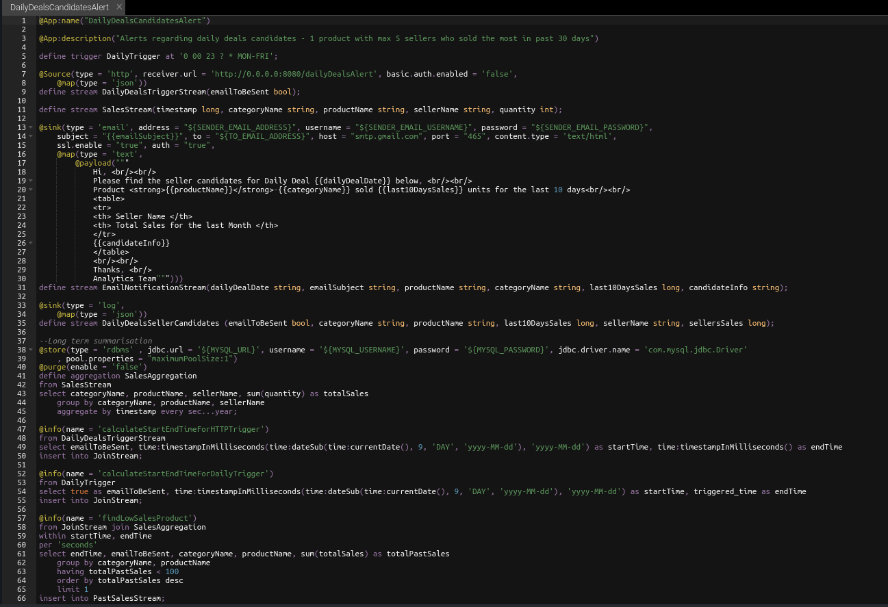](images/AlertAppSourceView.png)

Below are the flow diagram of the above Siddhi Apps.

Siddhi App 1

[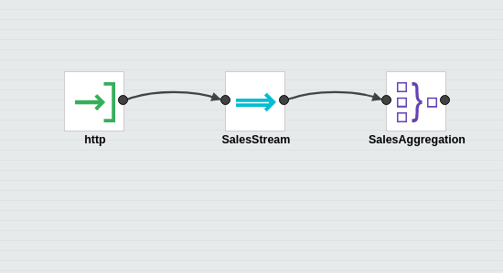](images/AggregationAppDesignView.png)

Siddhi App 2

[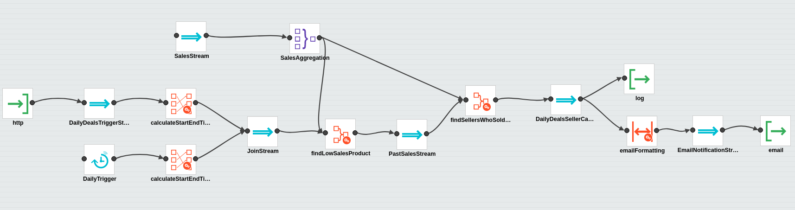](images/AlertAppDesignView.png)

## Testing

NOTE: In the provided Siddhi app, there are some environmental variables (EMAIL_USERNAME,EMAIL_PASSWORD, SENDER_EMAIL_ADDRESS and RECEIVER_EMAIL_ADDRESS) used which are required to be set to send an email alert based on the Siddhi queries defined. Moreover, we are using a MySQL database backend to persist aggregation data.

Hence, make sure to set the environmental variables with the proper values in the system

* SENDER_EMAIL_ADDRESS: Email address of the account used to send email alerts. (eg: 'siddhi.gke.user@gmail.com')

* EMAIL_USERNAME: Username of the email account which used to send email alerts. (eg: 'siddhi.gke.user')

* EMAIL_PASSWORD: Password of the email account which used to send email alerts. (eg: 'siddhi123')

* RECEIVER_EMAIL_ADDRESS: Email address of the account used to receive email alerts.

* MYSQL_URL: MySQL url used to connect to the database. (eg: 'jdbc:mysql://localhost:3306/testdb?useSSL=false')

* MYSQL_USERNAME: Username of the MySQL database used to persist aggregated data.

* MYSQL_PASSWORD: Password of the MySQL database used to persist aggregated data.

### Setup MySQL

1. Download and Install MySQL database as per the guidelines [https://www.mysql.com/downloads/](https://www.mysql.com/downloads/)
2. Log in to the MySQL server and create a database called “testdb”
3. Download the MySQL client connector [jar](https://dev.mysql.com/downloads/connector/j/) and add it to `jars` (if it is non OSGi) or `bundles` (if it is OSGi bundle) directory of Siddhi distribution

### Tryout

When you run the Siddhi app in the editor, you will see below logs getting printed in the editor console.

[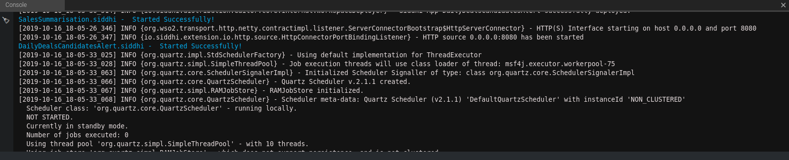](images/editor-app-run-mode.png)

* You could simply simulate some events directly into the stream and test your Siddhi app in the editor itself.
* You can also send data for the past 5 days using the siddhi mock data generator.
* Then, you can also simulate some events through HTTP to test the application. The following sections explain how you can test the Siddhi app via HTTP using cURL.

#### Run Mock Data Generator

In the provided Siddhi app, there is an HTTP source configured to receive sales data. For simplicity, you will be mocking this data through a generator . Please download the mock server [jar](https://github.com/niveathika/siddhi-mock-data-generator/releases/download/v2.0.0/siddhi-mock-data-generator-2.0.0.jar) and run that mock service by executing the following command.

```console
java -jar siddhi-mock-data-generator-2.0.0.jar
```

#### Invoking the Siddhi App

As per the Siddhi app that you wrote in the 'Implementation' section, each day at 11pm an email will be generated with the candidates for the Daily Deal tomorrow.

Furthermore, this can be generated by sending a POST request to `http://localhost:8080/dailyDealsAlert`.

```console
curl -X POST \
  http://localhost:8080/dailyDealsAlert \
  -k \
  -H 'Content-Type: application/json' \
  -d '{
    "emailToBeSent": true
}'
```

If you invoke the above cURL request email alert will be triggered. You can also observe the logs along with the details sent in the email.

```console
DailyDealsCandidatesAlert : DailyDealsSellerCandidates : [
{"event":{"emailToBeSent":true,"categoryName":"Accessories","productName":"Earring","last10DaysSales":80,"sellerName":"Malfoy","sellersSales":20}},
{"event":{"emailToBeSent":true,"categoryName":"Accessories","productName":"Earring","last10DaysSales":80,"sellerName":"George","sellersSales":20}},
{"event":{"emailToBeSent":true,"categoryName":"Accessories","productName":"Earring","last10DaysSales":80,"sellerName":"Harry","sellersSales":20}},
{"event":{"emailToBeSent":true,"categoryName":"Accessories","productName":"Earring","last10DaysSales":80,"sellerName":"Molly","sellersSales":10}},
{"event":{"emailToBeSent":true,"categoryName":"Accessories","productName":"Earring","last10DaysSales":80,"sellerName":"Fred","sellersSales":10}}
]
```

Note: The configurations provided in the email sink along with the environment properties will work for Gmail, but if you use other mail servers, please make sure to change the config values accordingly.

[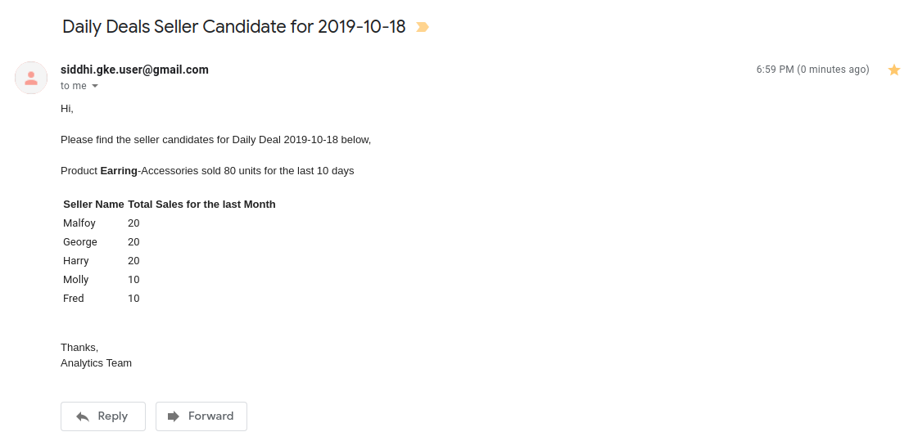](images/simulation-email-output.png)

## Deployment

Once you are done with the development, export the Siddhi app that you have developed with 'File' -> 'Export File' option.

You can deploy the Siddhi app using any of the methods listed below.

### Deploy on VM/ Bare Metal

#### Prerequisites

First, please make sure that necessary prerequisites are met as given the [Testing section](#testing). MySQL is required to try out the use case.

Then, as given in [Setup MySQL](#setup-mysql) section. Download the MySQL database and install it. Then create a database called “testdb” in the MySQL database.

Environmental variables related to Email and MySQL needs to be exported.

#### Siddhi Runner Configuration

1. Download the latest Siddhi Runner [distribution](https://github.com/siddhi-io/distribution/releases/download/v5.1.0/siddhi-runner-5.1.0.zip).
2. Unzip the `siddhi-runner-x.x.x.zip`.
3. Configure the necessary environmental variables. Refer [Testing](#Testing)
4. Start Siddhi app with the runner config by executing the following commands from the distribution directory.

    ```console
    Linux/Mac : ./bin/runner.sh -Dapps=<siddhi-files-directory>
    Windows : bin\runner.bat -Dapps=<siddhi-files-directory>
    ```

5. If pointing to different DB, run the mock data generator to add data for past 5 days sales. Download the [mock data generator](https://github.com/niveathika/siddhi-mock-data-generator/releases/download/v2.0.0/siddhi-mock-data-generator-2.0.0.jar). Execute the below command to run the mock data generator.

    ```console
    java -jar siddhi-mock-data-generator-2.0.0.jar
    ```

6. Invoke the dailyDealsAlert service with the following cURL request. You can set `emailToBeSent` as false to not send an email but only to observe the logs.

    ```console
    curl -X POST \
    http://localhost:8080/dailyDealsAlert \
    -k \
    -H 'Content-Type: application/json' \
    -d '{
        "emailToBeSent": true
    }'
    ```

7. You can see the output log in the console. Here, you will be able to see the alert log printed as shown below.

     [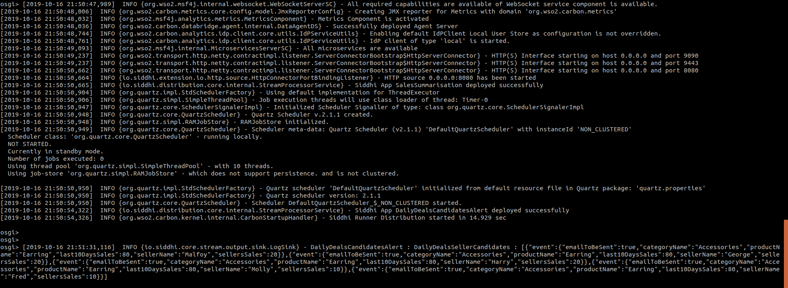](images/console-output-vm.png)

8. At the same time, you will also receive the email alert if `emailToBeSent` is true.

### Deploy on Docker

#### Prerequisites

MySQL is an external dependency for this use case. Hence, you could use the corresponding docker artifacts to test the requirement.

1. First, you can create a docker network for the deployment as shown below

    ```console
    docker network create siddhi-tier --driver bridge
    ```

2. Then, you can get the MySQL docker image from [here](https://hub.docker.com/_/mysql) and run it with below command. We are going to use mysql version 5.7.27.

    [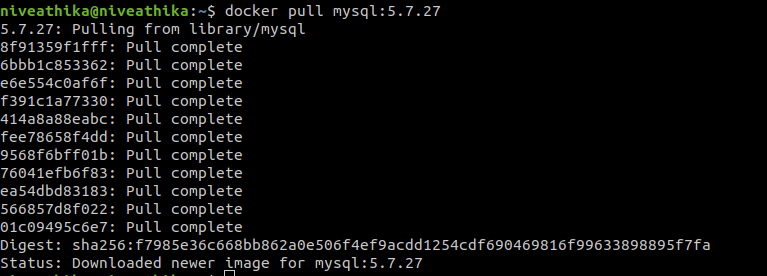](images/mysql-docker-pull.png)

3. Start the MySQL docker images with below command,

    ```console
    docker run -d --name mysql-server --network siddhi-tier  -e MYSQL_DATABASE=testdb -e MYSQL_ROOT_PASSWORD=root mysql:5.7.27
    ```

    !!! info
        Check if the image is started correctly by using `docker ps`.
        The above command will start mysql server with credentials `root:root` and create a database `testdb`

4. Now, you have configured necessary prerequisites that required to run the use case.

#### Siddhi Docker Configuration

Siddhi docker artifacts can be exported from the Editor UI as follows,

1. Start the Siddhi [tooling](https://siddhi.io/en/v5.0/docs/tooling/) runtime and go to the editor UI in [http://localhost:9390/editor](http://localhost:9390/editor)

    Follow below steps to start the Siddhi tooling runtime.
    * Extract the downloaded zip and navigate to <TOOLING_HOME>/bin. (TOOLING_HOME refers to the extracted folder)
    * Issue the following command in the command prompt (Windows) / terminal (Linux/Mac)

        For Windows: tooling.bat
        For Linux/Mac: ./tooling.sh

2. Go to Export -> For Docker Option to export and push the docker image.

    * Step 1: Select both siddhi apps
        [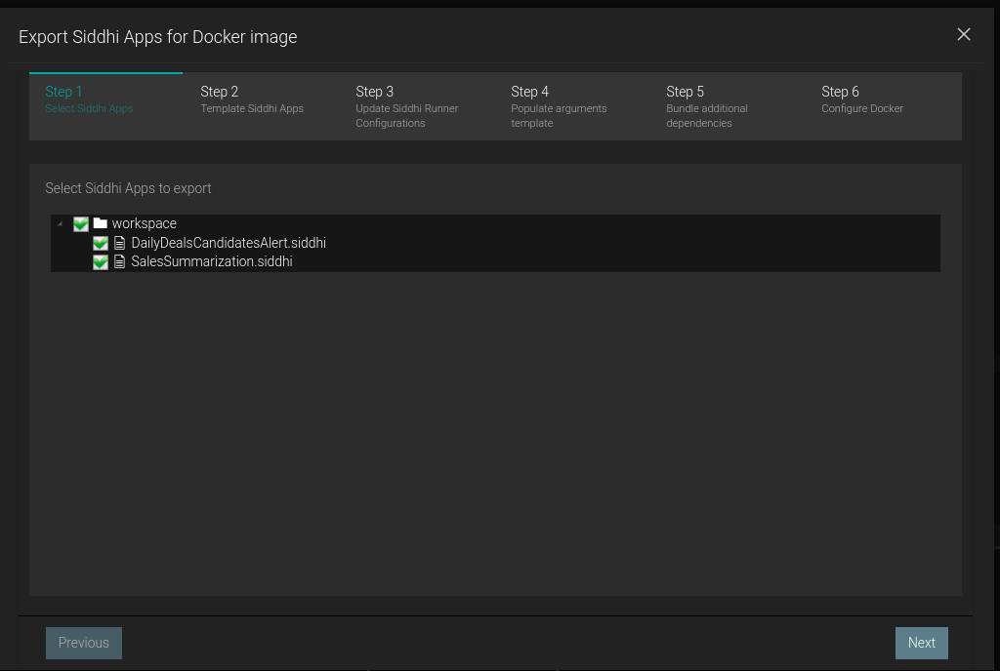](images/docker/step1.png)

    * Step 2: No need to template siddhi apps as it is already a template
        [](images/docker/step2.png)

    * Step 3: Default configs can be used
        [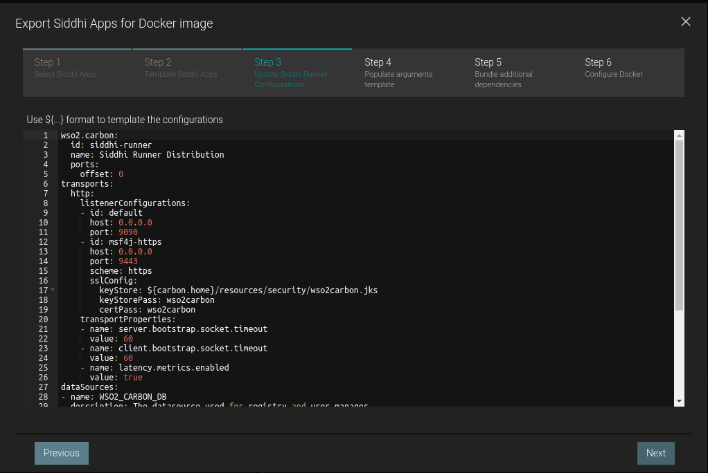](images/docker/step3.png)

    * Step 4: Fill the template variables

        !!! info "Setting MYSQL_URL"
            Since we are using MySQL docker container MySQL URL should be `jdbc:mysql://<mysql docker container name>:3306/<created DB>?useSSL=false` i.e `jdbc:mysql://mysql-server:3306/testdb?useSSL=false` by default

        [](images/docker/step4.png)

    * Step 5: Select MySQL connector to use
        [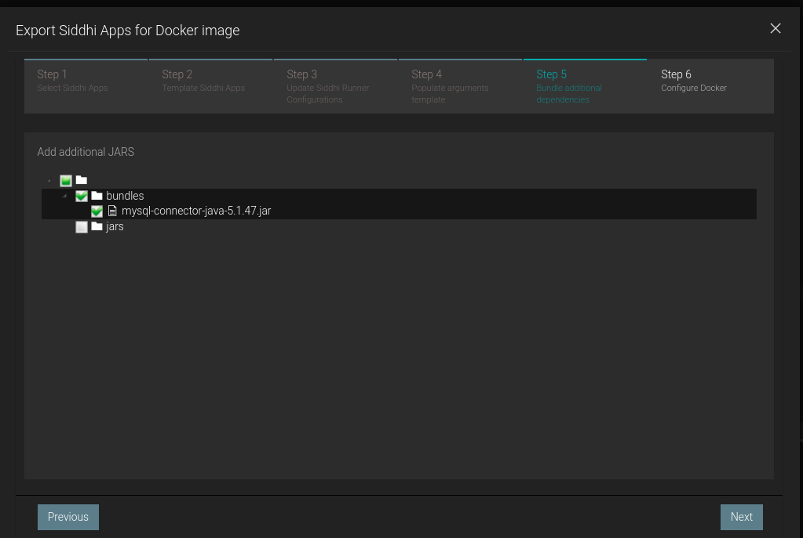](images/docker/step5.png)

    * Step 6: Push to docker repository
        [](images/docker/step6.png)

3. Then, you can run the Siddhi docker image that you created with necessary external dependencies to work with MySQL.

    ```console
    docker run --network siddhi-tier -p 8080:8080 -it  <docker-image-name>  
    ```

    !!! info
        Here port 8080 is bound with localhost:8080 to run the mock-data generator

4. You can use the sample mock data generator to add data for past 5 days sales. Download the [mock data generator](https://github.com/niveathika/siddhi-mock-data-generator/releases/download/v2.0.0/siddhi-mock-data-generator-2.0.0.jar). Execute the below command to run the mock data generator.

    ```console
    java -jar siddhi-mock-data-generator-2.0.0.jar
    ```

5. Invoke the dailyDealsAlert service with the following cURL request. You can set `emailToBeSent` as false to not send an email but only to observe the logs.

    ```console
    curl -X POST \
    http://localhost:8080/dailyDealsAlert \
    -k \
    -H 'Content-Type: application/json' \
    -d '{
        "emailToBeSent": true
    }'
    ```

6. You can see the output log in the console. Here, you will be able to see the alert log printed as shown below.

     [](images/console-output-docker.png)

### Deploy on Kubernetes

#### Prerequisites

MySQL is an external dependency for this use case. Hence, you could use the corresponding docker artifacts to test the requirement.

1. It is advisable to create a namespace in Kubernetes to follow below steps.

    ````console
    kubectl create ns agg-guide
    ````

2. There are some prerequisites that you should meet to tryout below SiddhiProcess. Such as configure MySQL database in Kubernetes. First, configure the MySQL server within the created namespace as in Step 1. You can use the official [helm chart](https://github.com/helm/charts/tree/master/stable/mysql) provided for MySQL.

    * First, install the MySQL helm chart as shown below,

        ````console
        helm install --name mysql-server --namespace=agg-guide --set mysqlRootPassword=root,mysqlUser=root,mysqlDatabase=testdb stable/mysql
        ````

        Here, you can define the root password to connect to the MYSQL database and also define the database name. BTW, make sure to do `helm init --tiller-namespace=agg-guide` if it is not done yet.

        Verify pods are running with `kubectl get pods --namespace=agg-guide`

    * Then, you can set a port forwarding to the MySQL service which allows you to connect from the Host.

        ````console
        kubectl port-forward svc/mysql-server 13300:3306 --namespace=agg-guide
        ````

    * Then, you can login to the MySQL server from your host machine as shown below.

        [](images/k8s-mysql-db-info.png)

3. Afterwards, you can install Siddhi Operator

    * To install the Siddhi Kubernetes operator run the following commands.

        ````console
        kubectl apply -f https://github.com/siddhi-io/siddhi-operator/releases/download/v0.2.1/00-prereqs.yaml  --namespace=agg-guide
        kubectl apply -f https://github.com/siddhi-io/siddhi-operator/releases/download/v0.2.1/01-siddhi-operator.yaml --namespace=agg-guide
        ````

    * You can verify the installation by making sure the following deployments are running in your Kubernetes cluster.

        [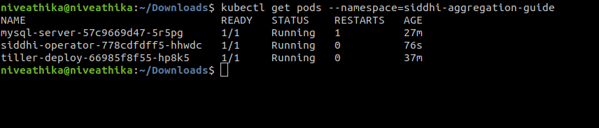](images/k8s-pods.png)

        [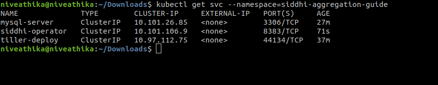](images/k8s-svc.png)

4. Enable [ingress](https://kubernetes.github.io/ingress-nginx/deploy/)
    * Mandatory Commands for all clusters

        ```console
        kubectl apply -f https://raw.githubusercontent.com/kubernetes/ingress-nginx/master/deploy/static/mandatory.yaml
        ```

    * Docker for Mac/Docker for Windows

        ```console
        kubectl apply -f https://raw.githubusercontent.com/kubernetes/ingress-nginx/master/deploy/static/provider/cloud-generic.yaml
        ```

    * Minikube

        ```console
        minikube addons enable ingress
        ```

    * GKE

        ```console
        kubectl apply -f https://raw.githubusercontent.com/kubernetes/ingress-nginx/master/deploy/static/provider/cloud-generic.yaml
        ```

5. Configure Kubernetes cluster IP as “siddhi” hostname in your /etc/hosts file.
    * Minikube: add minikube IP to the “/etc/hosts” file as host “siddhi”, Run “minikube ip” command in terminal to get the minikube IP.
    * Docker for Mac: use 0.0.0.0 to the /etc/hosts file as host “siddhi”.
    * Docker for Windows: use IP that resolves to host.docker.internal in the /etc/hosts file as host “siddhi”.
    * GKE: Obtain the external IP (EXTERNAL-IP) of the Ingress resources by listing down the Kubernetes Ingresses.

#### Siddhi Kubernetes configuration

1. To deploy the above created Siddhi app, we have to create custom resource object yaml file (with the kind as SiddhiProcess). Kubernetes CRD can be exported from the Siddhi [tooling](https://siddhi.io/en/v5.0/docs/tooling/) runtime with the editor UI in [http://localhost:9390/editor](http://localhost:9390/editor)
    * Select the Export -> For Kubernetes Option

    * Steps 1- 5 is the same for both artifacts.

    * In Step 6, push the docker image with different name to Docker deployment.

        !!! info
            This docker image will be different to the one pushed in Docker deployment, since only base image with additional bundles will be push to the docker in Kubernetes deployment.

        !!! info
            Ensure that the pushed docker image is public

    * Step 7 : Let's create non-distributed and stateless deployment
        [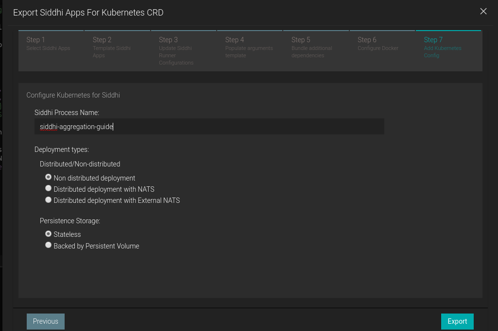](images/step7.png)

    * Extract siddhi-kubernetes.zip

2. Now,  let’s create the above resource in the Kubernetes  cluster with below command.

    ````console
    kubectl --namespace=agg-guide apply -f <absolute-path>/siddhi-kubernetes/siddhi-process.yaml
    ````

    Once, siddhi apps are successfully deployed. You can verify its health with below Kubernetes commands

    [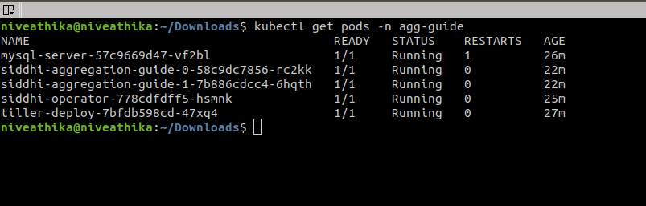](images/k8s-pods-with-siddhi.png)

3. You can use the sample mock data generator to add data for past 5 days sales. Download the [mock data generator](https://github.com/niveathika/siddhi-mock-data-generator/releases/download/v2.0.0/siddhi-mock-data-generator-2.0.0.jar). Execute the below command to run the mock data generator.

    ```console
    java -jar siddhi-mock-data-generator-2.0.0.jar siddhi/siddhi-aggregation-guide-0/8080
    ```

    !!! note "Hostname of the HTTP Source"
            Here the hostname will include deployment name along with the port with syntax, `<IP>/<DEPLOYMENT_NAME>/<PORT>`.
            The above sample is for artifacts generated with process name, `siddhi-aggregation-guide` in Step 6 of the Export Dialog.

4. Invoke the dailyDealsAlert service with the following cURL request. You can set `emailToBeSent` as false to not send an email but only to observe the logs.

    ```console
    curl -X POST \
    http://siddhi/siddhi-aggregation-guide-1/8080/dailyDealsAlert \
    -k \
    -H 'Content-Type: application/json' \
    -d '{
        "emailToBeSent": true
    }'
    ```

    !!!note "Hostname of the HTTP Source"
            Here the hostname will include deployment name along with the port with syntax, `<IP>/<DEPLOYMENT_NAME>/<PORT>`.
            The above sample is for artifacts generated with process name, `siddhi-aggregation-guide` in Step 6 of the Export Dialog.

5. You can see the output log in the console. Here, you will be able to see the alert log printed as shown below.

    [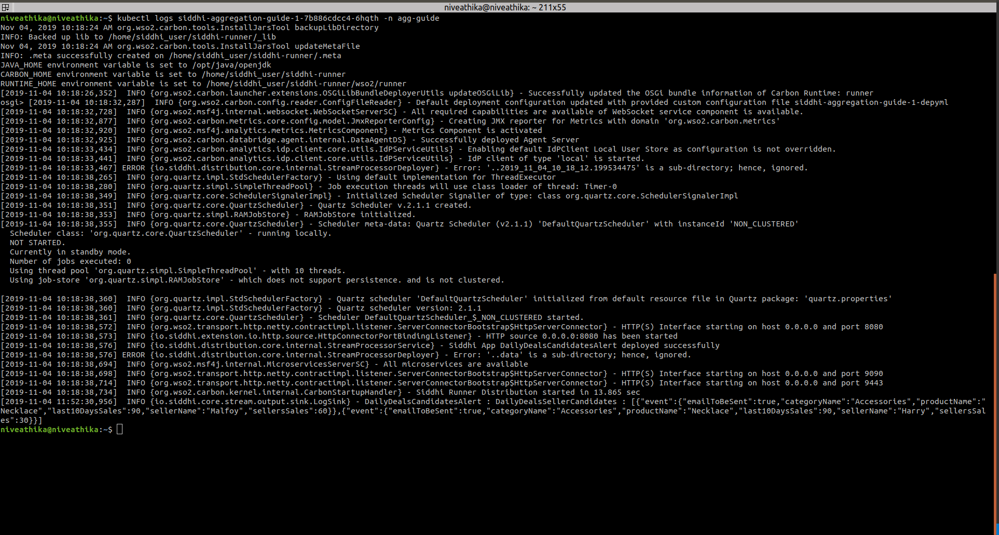](images/k8s-console-output.png)

    !!! info "Refer [here](https://siddhi.io/en/v5.1/docs/siddhi-as-a-kubernetes-microservice/) to get more details about running Siddhi on Kubernetes."
