Analyze Event Occurrence Patterns and Trends Over Time
=========================================================

In this guide, we are going to discuss a unique and appealing feature of a complex event processing system which is `Patterns and Trends`. Patterns and Trends are highly utilized in various business domains for the day to day business activities and growth. To understand these capabilities, we are going to consider a Taxi service use case.

## Scenario - Optimize Rider Requests in a Taxi Service Company
Taxi service is one of the emerging businesses in metro cities. There are a lot of Taxi service companies such as UBER, LYFT, OLA, GRAB, etc.. are in the market. Due to the number of competitors in the market passengers have the freedom to select their preferred Taxi service based on cost, waiting time, etc..  As a passenger, the main requirement is to find a Taxi within a short time (less waiting time). Then, it is important to understand the rider requests and effectively use the available drivers/riders. In this, identifying the trend of passenger request will help to get more passengers and increase the business overall.

The following sections are available in this guide.

* [What you'll build](#what-youll-build)
* [Prerequisites](#prerequisites)
* [Implementation](#implementation)
* [Testing](#testing)
* [Deployment & Output](#deployment)

## What you'll build

You will be implementing a scenario to identify the increasing trend of rider requests over time and direct required riders to that specific geographical area to increase the chance of getting more rides. You will be using Siddhi streaming engine and related stream processing capabilities to achieve the requirement. Let’s jump into the use case directly.

Let’s consider a Taxi service company called `myTaxi`. myTaxi is one of the startup Taxi service companies in the city and they have launched very recently. As per the analysis, they have found that they are a lot of ride cancellations happened over the last few months because the waiting time for the taxi is high. Even Though, myTaxi has enough riders they are not around the expected area where there is a sudden peak for rider requests. Then, they have decided to integrate a Stream Processing system to analyze the patterns and trends in real-time and act accordingly. 

In this solution, passengers use the myTaxi mobile application to book Taxi and those events are received to the myTaxi request processing system, it sends those events to Siddhi Stream Processor through TCP endpoint. Siddhi process those incoming events to identify predefined trends and patterns. Once a specific trend/patterns are identified then Siddhi sends those required trend/pattern specific attributes for further processing. In this case, that information is stored in a database.

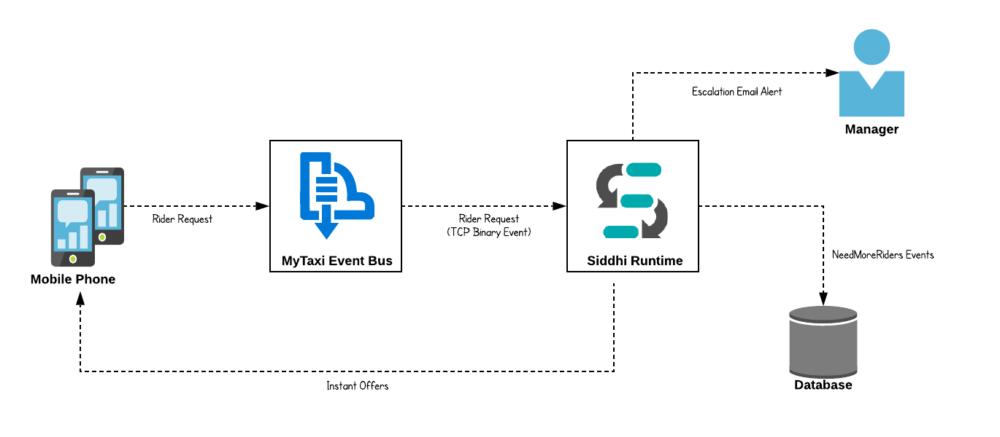

Now, let’s understand how this could be implemented in Siddhi engine.

## Prerequisites
Below are the prerequisites that should be considered to implement the above use case.

### Mandatory Requirements
* [Siddhi tooling VM/Local distribution](https://siddhi.io/en/v5.1/download/)
* One of the [Siddhi runner distributions](https://siddhi.io/en/v5.1/download/) 
    - VM/Local Runtime
    - Docker Image
    - K8S Operator (commands are given in deployment section)
* [MySQL Database](https://www.mysql.com)
* Java 8 or higher

### Requirements needed to deploy Siddhi in Docker/Kubernetes

* [Docker](https://docs.docker.com/engine/installation/)
* [Minikube](https://github.com/kubernetes/minikube#installation) or [Google Kubernetes Engine(GKE) Cluster](https://console.cloud.google.com/) or [Docker for Mac](https://docs.docker.com/docker-for-mac/install/)

## Implementation

### Implement Streaming Queries

1. Start the Siddhi [tooling](https://siddhi.io/en/v5.0/docs/tooling/) runtime and go to the editor UI in http://localhost:9390/editor 

    Follow below steps to start the Siddhi tooling runtime.
    * Extract the downloaded zip and navigate to <TOOLING_HOME>/bin. (TOOLING_HOME refers to the extracted folder) 
    * Issue the following command in the command prompt (Windows) / terminal (Linux/Mac)
        ```bash
        For Windows: tooling.bat
        For Linux/Mac: ./tooling.sh
        ```

2. Select File -> New option, then you could either use the source view or design view to write/build the Siddhi Application. You can find the Siddhi Application bellow, that implements the requirements mentioned above.

3. Let’s write (develop) the Siddhi Application, as given below.

4. Once the Siddhi app is created, you can use the Event Simulator option in the editor to simulate events to streams and perform developer testing.


```siddhi
@App:name("Taxi-Rider-Requests-Processing-App")
@App:description("Siddhi application that processes Taxi Rider request events")

-- TCP source which accepts Taxi rider requests
@source(type='tcp', context='taxiRideRequests', @map(type='binary'))
define stream TaxiRideEventStream(id long, time string, passengerId string, passengerName string, pickUpAddress string, pickUpZone string, 
dropOutAddress string, routingDetails string, expectedFare double, status string, passengerGrade string, additionalNote string);

-- For testing purposes, offer messages are logged in console. 
-- This could be further extended to send as sms to the premium users
@sink(type='log', @map(type = 'text', 
    @payload("""
Hi {{passengerName}}

    Unfortunately, you couldn't travel with us Today. We apologise for the high waiting time.
    As a token of apology please accept {{offerAmount}} USD off from your next ride.

Truly, 
MyTaxi Team""")))
define stream InstantOfferAlertStream(passengerName string, pickUpZone string, offerAmount double);

-- RDBMS event table which stores events related to the requirement of need more riders
@store(type="rdbms", jdbc.url="${MYSQL_DB_URL}", username="${MYSQL_USERNAME}", password="${MYSQL_PASSWORD}" , jdbc.driver.name="com.mysql.jdbc.Driver")
define table NeedMoreRidersTable (systemTime string, zone string);

-- Email sink which send email alerts to the manager of MyTaxi
@sink(type = 'email', username = "${EMAIL_USERNAME}", address = "${SENDER_EMAIL_ADDRESS}", password = "${EMAIL_PASSWORD}", 
subject = "[Need Immediate Attention] High Waiting Time", to = "${MANAGER_EMAIL_ADDRESS}", host = "smtp.gmail.com", port = "465", ssl.enable = "true", auth = "true", 
  @map(type = 'text', 
    @payload("""
Hi,

    There is an increasing trend of ride cancellations in the {{zone}} area due to high waiting time.  
    Increasing trend is detected at {{systemTime}}.
    Please take immediate action to sort this out.

Thanks...""")))
define stream AttentionRequiredCancellationStream (systemTime string, zone string, lastNoOfCancellations long);

@info(name='Ride-cancellation-identifier') 
from every e1=TaxiRideEventStream[status == 'Assigned'] -> 
        e2=TaxiRideEventStream[e1.passengerId == passengerId and status == 'Cancelled' and additionalNote == 'WT is High']
        within 30 seconds 
select e2.passengerName, e1.passengerGrade, e1.pickUpZone, e1.expectedFare
insert into TaxiRideCancelStream;

@info(name='Offer-for-premium-users') 
from TaxiRideCancelStream[passengerGrade == 'Premium']
select passengerName, pickUpZone, math:floor(expectedFare) / 2.0 as offerAmount
insert into InstantOfferAlertStream;

@info(name='Frequently-ride-cancellation-identifier') 
from TaxiRideCancelStream#window.timeBatch(1 min)
select pickUpZone, count() as totalCancellations, time:currentTimestamp() as systemTime
group by pickUpZone
having totalCancellations > 3
insert into NeedMoreRidersStream;

@info(name='Dump-needMoreRider-events') 
from NeedMoreRidersStream
select systemTime, pickUpZone as zone
insert into NeedMoreRidersTable;

@info(name='Ride-cancellation-increasing-trend-identifer') 
partition with (pickUpZone of NeedMoreRidersStream)
begin
    from e1 = NeedMoreRidersStream, e2 = NeedMoreRidersStream[totalCancellations > e1.totalCancellations], 
        e3 = NeedMoreRidersStream[totalCancellations > e2.totalCancellations]
    select e3.systemTime, e1.pickUpZone as zone, e3.totalCancellations as lastNoOfCancellations
    insert into AttentionRequiredCancellationStream;
end; 
```

Source view of the Siddhi app.


Below is the flow diagram of the above Siddhi App.

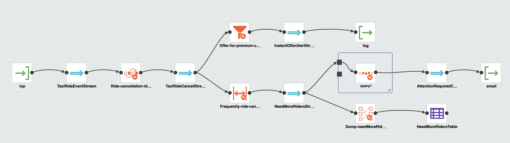


## Testing

NOTE: In the above provided Siddhi app, there are some environmental variables (MYSQL_DB_URL, MYSQL_USERNAME, and  MYSQL_PASSWORD)  are used. These values are required to be set to try out the scenario end to end. MYSQL related environmental variables are required to store the events of stream `NeedMoreRidersStream`. Environmental variables EMAIL_PASSWORD, EMAIL_USERNAME, SENDER_EMAIL_ADDRESS and MANAGER_EMAIL_ADDRESS  are used to send an email alert when there is an increasing trend of cancellation on specific area.

 * MYSQL_DB_URL: MySQL database jdbc url to persist failed events. (eg: 'jdbc:mysql://localhost:3306/MyTaxi')
 * MYSQL_USERNAME: Username of the user account to connect MySQL database. (eg: 'root')
 * MYSQL_PASSWORD: Password of the user account to connect MySQL database. (eg: 'root')
 * EMAIL_USERNAME: Username of the email account which used to send email alerts. (eg: 'siddhi.gke.user')
 * EMAIL_PASSWORD: Password of the email account which used to send email alerts. (eg: 'siddhi123')
 * SENDER_EMAIL_ADDRESS: Email address of the account used to send email alerts. (eg: 'siddhi.gke.user@gmail.com')
 * MANAGER_EMAIL_ADDRESS: Destination Email address where escalation mails are sent. (eg: 'manager@mytaxi.com')

### Setup MySQL

1. Download and Install MySQL database as per the guidelines (https://www.mysql.com/downloads/)
2. Log in to the MySQL server and create a database called “MyTaxi”
3. Download the MySQL client connector [jar](https://dev.mysql.com/downloads/connector/j/) and add it to `jars` (if it is non OSGI) or `bundles` (if it is OSGI bundle) directory of Siddhi distribution

### Tryout

There are multiple options available to test the developed Siddhi App. As mentioned in the previous step you could simply simulate some events directly into the stream and test your queries.

But, if you are willing to test the end to end flow (from an input source to sink) then you can start the Siddhi app in the editor itself. In this guide, we are going to run the Siddhi App in the editor itself. 

Once the server is started, you will see below logs get printed in the editor console.

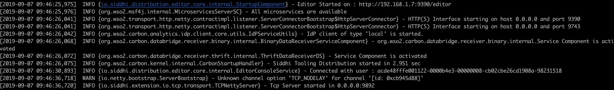

As written in the above Siddhi application, taxi ride requests are accepted by the TCP endpoint of the Siddhi Stream Processor; those events are pushed to a stream called `taxiRideEventStream`. The first query is written to identify the pattern of rider cancellation after rider request within 30 seconds due to high waiting time. If such a pattern is identified then system will the user grade and grant some offers for subsequent rides for `premium` users. 

Parallelly, Stream Processor keep tracking the number of ride cancellations for each minute and if it found a situation of more than 3 ride cancellation then the system will identify that area/zone and send that details to next processing system to take necessary action. In the above query, such events are pushed to a database table. 

There is another query which continuously listens for the total number of cancellations for each minute and looking for increasing trend of ride cancellations and notifies accordingly. In this situation, if the Streaming system sends an email alert to the manager of the MyTaxi for his/her further consideration.

### Invoking the Siddhi App

To try out the above use case, you have to send a set of events in a certain order to match with the query conditions. There is a sample TCP publisher could publish events in such an order. Hence, you could use the sample publisher given in [here](https://github.com/mohanvive/siddhi-sample-clients/releases/download/v1.0.0/tcp-producer-1.0.0-jar-with-dependencies.jar). 

Then you can execute below command to run the TCP client. 

```bash
java -jar tcp-producer-1.0.0-jar-with-dependencies.jar 
```

It will take nearly 3 minutes to publish events which required to test all the flows in the given Siddhi app.

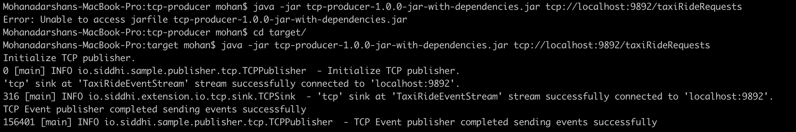

When you are publishing events to Siddhi Stream processor, you could see the logs that get printed in Siddhi Stream processor side as well. There are related to instant offer alerts. Once, TCP publisher completes publishing events then you could check the email alert which is generated.

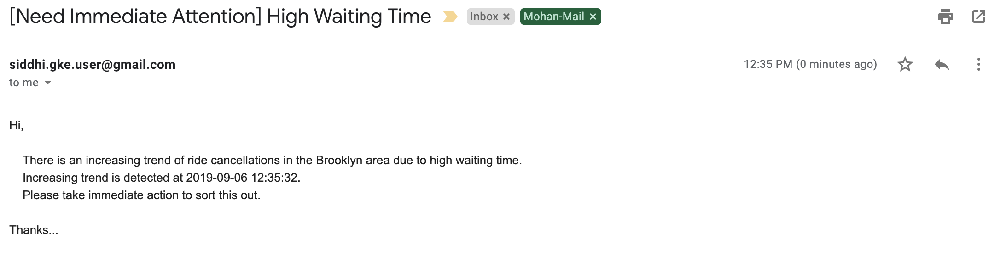


## Deployment

Once you are done with the development, export the Siddhi app that you have developed with 'File' -> 'Export File' option.

You can deploy the Siddhi app using any of the methods listed below. 

### Deploy on VM/ Bare Metal

#### Prerequisites
First, please make sure that necessary prerequisites are met as given the [Testing section](#testing). MySQL is required to try out the use case. 

Then, as given in the [Setup MySQL](#setup-mysql) section. Download the MySQL database and install it. Then create a database called “MyTaxi” in the MySQL database.

#### Siddhi Runtime Configuration

1. Make sure to set the necessary environmental variables as given above.
    
    Note: In the above provided Siddhi app, there are some environmental variables (MYSQL_DB_URL, MYSQL_USERNAME, and  MYSQL_PASSWORD)  are used. These values are required to be set to try out the scenario end to end. MYSQL related environmental variables are required to store the events of stream `NeedMoreRidersStream` . Environmental variables EMAIL_PASSWORD, EMAIL_USERNAME, SENDER_EMAIL_ADDRESS and MANAGER_EMAIL_ADDRESS  are used to send an email alert when there is an increasing trend of cancellation on specific area. 
    Hence, make sure to set the environmental variables with the proper values in the system (make sure to follow necessary steps based on the underneath operating system).  
    
2. Download the latest Siddhi Runner [distribution](https://github.com/siddhi-io/distribution/releases/download/v5.1.0-alpha/siddhi-runner-5.1.0-alpha.zip).
3. Unzip the `siddhi-runner-x.x.x.zip`.
4. You have to copy necessary Mysql client jar to Siddhi runner distribution to connect with MySQL database. Copy the MySQL client connector jar to `jars` (if it is non OSGI) or `bundles` (if it is OSGI bundle) directory of Siddhi runner.
    Please refer [this](https://siddhi.io/en/v5.1/docs/config-guide/#adding-to-siddhi-local-microservice) for information.

5. Start Siddhi app with the runner config by executing the following commands from the distribution directory.
        
     ```bash
     Linux/Mac : ./bin/runner.sh -Dapps=<siddhi-file-path> 
     Windows : bin\runner.bat -Dapps=<siddhi-file-path> 

	    Eg: If exported siddhi app in Siddhi home directory,
            ./bin/runner.sh -Dapps=Taxi-Rider-Requests-Processing-App.siddhi
     ```
     
     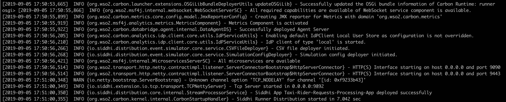 
      
    
6. Once server is started, download the sample TCP event generator from [here](https://github.com/mohanvive/siddhi-sample-clients/releases/download/v1.0.0/tcp-producer-1.0.0-jar-with-dependencies.jar) and execute below command.

    ```bash
    java -jar tcp-producer-1.0.0-jar-with-dependencies.jar tcp://localhost:9892/taxiRideRequests
    ```
    
    Above event publishes send binary events through TCP to the TCP endpoint defined in the Siddhi application. You can change the TCP endpoint url by passing them as java arguments. If not, sample client consider `tcp://localhost:9892/taxiRideRequests` as the TCP endpoint url.
    
    !!! info "You can find the sample client source code in [here](https://github.com/mohanvive/siddhi-sample-clients)"

7. In this situation, you can find the logs printed in the Siddhi runner console/log, events related to `NeedMoreRidersStream`  are stored in the database table and escalation email is sent to the manager when there is an increasing trend found in the cancellations.
    
    
    
    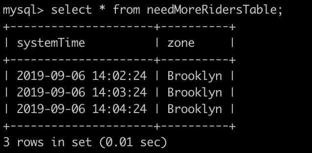
    
    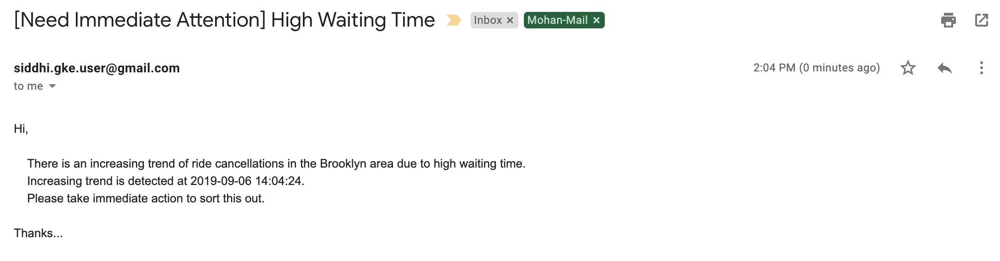

### Deploy on Docker

#### Prerequisites

MySQL is an external dependency for this use case. Hence, you could use the corresponding MySQL docker artifact to test the requirement.

1. First, you can create a docker network for the deployment as shown below
    ```bash
	docker network create siddhi-tier --driver bridge
	```

2. Then, you can get the MySQL docker image from [here](https://hub.docker.com/_/mysql) and run it with below command. We are going to use mysql version 5.7.27.
    
    

3. Start the MySQL docker images with below command,

    ```bash
	docker run --name mysql-server --network siddhi-tier -e MYSQL_ROOT_PASSWORD=root e1e1680ac726
	```

	!!! info "`e1e1680ac726` is the MySQL docker image id in this case"

4. Login to the MySQL docker instance and create a database called “MyTaxi”.

    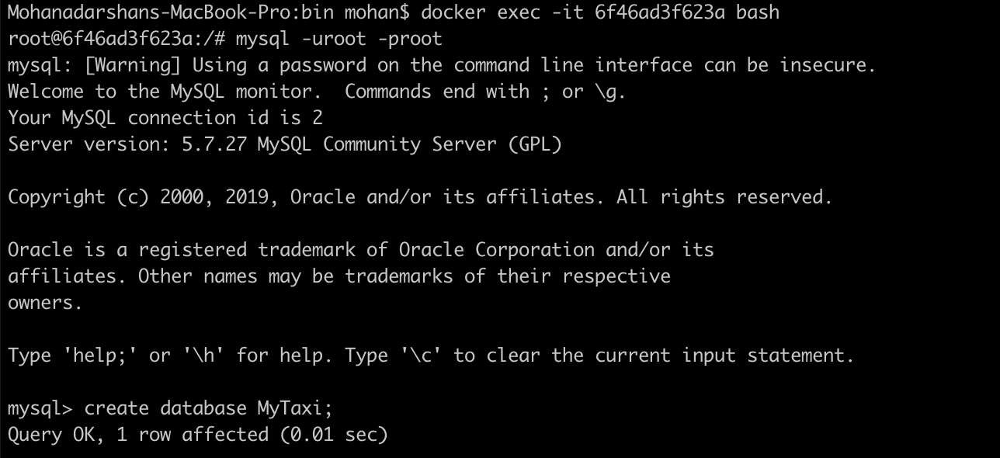 

5. Now, you have configured necessary prerequisites that required to run the use case. 

#### Siddhi Docker Configuration

1. Since, MySQL client jar is required for the Siddhi runner; you have to create the docker image accordingly. Below is the sample Docker file created

    ```docker
    FROM siddhiio/siddhi-runner-base-alpine:5.1.0-alpha
    MAINTAINER Siddhi IO Docker Maintainers "siddhi-dev@googlegroups.com"
    
    ARG HOST_BUNDLES_DIR=./files/bundles
    ARG HOST_JARS_DIR=./files/jars
    ARG JARS=${RUNTIME_SERVER_HOME}/jars
    ARG BUNDLES=${RUNTIME_SERVER_HOME}/bundles
    
    # copy bundles & jars to the siddhi-runner distribution
    COPY --chown=siddhi_user:siddhi_io ${HOST_JARS_DIR}/ ${JARS}
    
    # expose ports
    EXPOSE 9090 9443 9712 9612 7711 7611 7070 7443
    
    RUN bash ${RUNTIME_SERVER_HOME}/bin/install-jars.sh
    
    STOPSIGNAL SIGINT
    
    ENTRYPOINT ["/home/siddhi_user/siddhi-runner/bin/runner.sh",  "--"]
    ```
    
    Here, you have to create a folder called `jars` to add necessary external client dependencies to the docker image.

    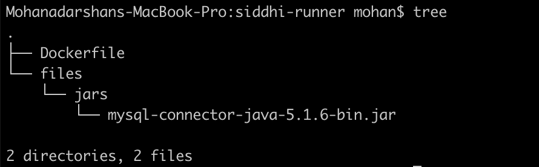 

    You can refer the official Siddhi documentation [reference](https://siddhi.io/en/v5.1/docs/config-guide/#adding-to-siddhi-docker-microservice) for this purpose.
    
2. Once, Dockerfile is created you can create the docker image with below command.

    ```bash
    docker build -t siddhi_mysql .
    ```
    
3. Then, you can run the Siddhi docker image that you created with necessary external dependencies to work with MySQL. 

    ```bash
    docker run --network siddhi-tier -it -p 9892:9892  -v /Users/mohan/siddhi-apps/:/siddhi-apps  -e MYSQL_DB_URL=jdbc:mysql://mysql-server:3306/MyTaxi -e MYSQL_USERNAME=root -e MYSQL_PASSWORD=root -e EMAIL_USERNAME=siddhi.gke.user -e EMAIL_PASSWORD=siddhi123 -e SENDER_EMAIL_ADDRESS=siddhi.gke.user@gmail.com -e MANAGER_EMAIL_ADDRESS=mohan@wso2.com siddhi_mysql:latest -Dapps=/siddhi-apps/Taxi-Rider-Requests-Processing-App.siddhi
    ```
    
    Note: In the above provided Siddhi app, there are some environmental variables (MYSQL_DB_URL, MYSQL_USERNAME, and  MYSQL_PASSWORD)  are used. These values are required to be set to try out the scenario end to end. MYSQL related environmental variables are required to store the events of stream `NeedMoreRidersStream` . Environmental variables EMAIL_PASSWORD, EMAIL_USERNAME, SENDER_EMAIL_ADDRESS and MANAGER_EMAIL_ADDRESS  are used to send an email alert when there is an increasing trend of cancellation on specific area. 
    
4. You can use the sample [TCP event publisher](https://github.com/mohanvive/siddhi-sample-clients/releases/download/v1.0.0/tcp-producer-1.0.0-jar-with-dependencies.jar )  to simulate required events. Use the below command to publish events to TCP endpoint.

    ```bash
    java -jar tcp-producer-1.0.0-jar-with-dependencies.jar tcp://localhost:9892/taxiRideRequests
    ```
   
5. Then, you could see below logs get printed in the Siddhi runner console/log, events related to `NeedMoreRidersStream`  are stored in the database table and escalation email is sent to the manager when there is an increasing trend found in the cancellations. 

    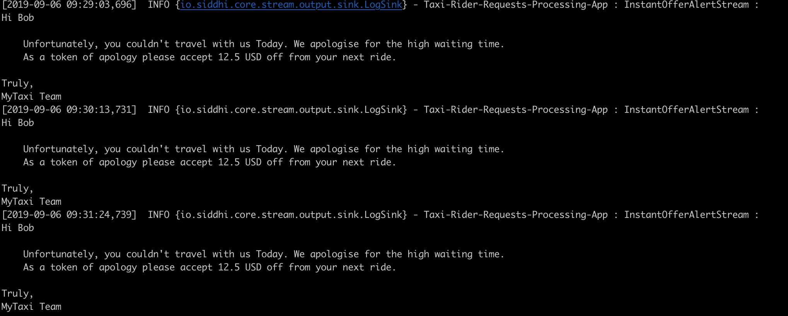
        
    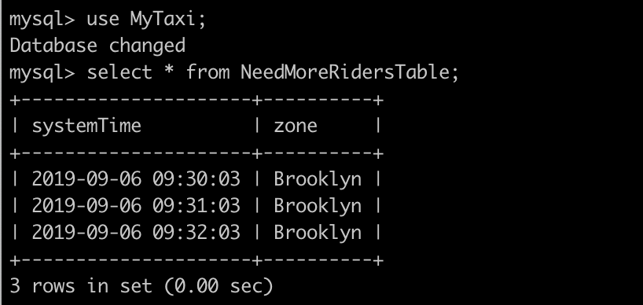
        
    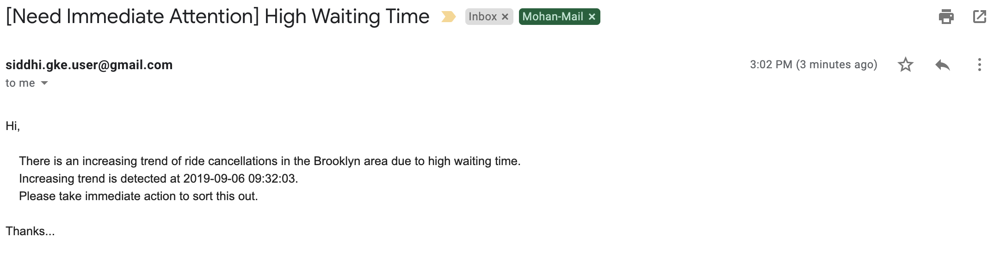


### Deploy on Kubernetes

1. It is advisable to create a namespace in Kubernetes to follow below steps.
    ```bash
    kubectl create ns siddhi-mysql-test
    ```

2. There is a prerequisite that you should meet to tryout below SiddhiProcess; configuring MySQL database server within the above created namespace. You can use the official [helm chart](https://github.com/helm/charts/tree/master/stable/mysql) provided for MySQL.

    * First, install the MySQL helm chart as shown below,
        ```bash
        helm install --name mysql-db --namespace=siddhi-mysql-test --set mysqlRootPassword=root,mysqlDatabase=MyTaxi stable/mysql
        ```

        Here, you can define the root password to connect to the MYSQL database and also define the database name. BTW, make sure to do `helm init` if it is not done yet.

    * Then, you can set a port forwarding to the MySQL service which allows you to connect from the Host.
	    
	    ```bash
	    kubectl port-forward svc/mysql-db 13306:3306 --namespace=siddhi-mysql-test
	    ```

    * Then, you can login to the MySQL server from your host machine as shown below.
    
         
   
3. Then, you can install Siddhi Operator

    - To install the Siddhi Kubernetes operator run the following commands.
        
        ```bash
        kubectl apply -f https://github.com/siddhi-io/siddhi-operator/releases/download/v0.2.0-alpha/00-prereqs.yaml  --namespace=siddhi-mysql-test
        kubectl apply -f https://github.com/siddhi-io/siddhi-operator/releases/download/v0.2.0-alpha/01-siddhi-operator.yaml --namespace=siddhi-mysql-test
        ```
        
    - You can verify the installation by making sure the following deployments are running in your Kubernetes cluster.
     
        
        

4. Siddhi applications can be deployed on Kubernetes using the Siddhi operator.

    - To deploy the above created Siddhi app, we have to create custom resource object yaml file (with the kind as SiddhiProcess) as given below
    
        ```yaml
        apiVersion: siddhi.io/v1alpha2
        kind: SiddhiProcess
        metadata:
          name: taxi-rider-requests-processing-app
        spec:
          apps:
           - script: |
                @App:name("Taxi-Rider-Requests-Processing-App")
                @App:description("Siddhi application that processes Taxi Rider request events")
        
                -- TCP source which accepts Taxi rider requests
                @source(type='tcp', context='taxiRideRequests', @map(type='binary'))
                define stream TaxiRideEventStream(id long, time string, passengerId string, passengerName string, pickUpAddress string, pickUpZone string, 
                dropOutAddress string, routingDetails string, expectedFare double, status string, passengerGrade string, additionalNote string);
        
                -- For testing purposes, offer messages are logged in console. 
                -- This could be further extended to send as sms to the premium users
                @sink(type='log', @map(type = 'text', 
                    @payload("""
                Hi {{passengerName}}
        
                    Unfortunately, you couldn't travel with us Today. We apologise for the high waiting time.
                    As a token of apology please accept {{offerAmount}} USD off from your next ride.
        
                Truly, 
                MyTaxi Team""")))
                define stream InstantOfferAlertStream(passengerName string, pickUpZone string, offerAmount double);
        
                -- RDBMS event table which stores events related to the requirement of need more riders
                @store(type="rdbms", jdbc.url="${MYSQL_DB_URL}", username="${MYSQL_USERNAME}", password="${MYSQL_PASSWORD}" , jdbc.driver.name="com.mysql.jdbc.Driver")
                define table NeedMoreRidersTable (systemTime string, zone string);
        
                -- Email sink which send email alerts to the manager of MyTaxi
                @sink(type = 'email', username = "${EMAIL_USERNAME}", address = "${SENDER_EMAIL_ADDRESS}", password = "${EMAIL_PASSWORD}", 
                subject = "[Need Immediate Attention] High Waiting Time", to = "${MANAGER_EMAIL_ADDRESS}", host = "smtp.gmail.com", port = "465", ssl.enable = "true", auth = "true", 
                  @map(type = 'text', 
                    @payload("""
                Hi,
                            
                    There is an increasing trend of ride cancellations in the {{zone}} area due to high waiting time.  
                    Increasing trend is detected at {{systemTime}}.
                    Please take immediate action to sort this out.
        
                Thanks...""")))
                define stream AttentionRequiredCancellationStream (systemTime string, zone string, lastNoOfCancellations long);
        
                @info(name='Ride-cancellation-identifier') 
                from every e1=TaxiRideEventStream[status == 'Assigned'] -> 
                        e2=TaxiRideEventStream[e1.passengerId == passengerId and status == 'Cancelled' and additionalNote == 'WT is High']
                        within 30 seconds 
                select e2.passengerName, e1.passengerGrade, e1.pickUpZone, e1.expectedFare
                insert into TaxiRideCancelStream;
        
                @info(name='Offer-for-premium-users') 
                from TaxiRideCancelStream[passengerGrade == 'Premium']
                select passengerName, pickUpZone, math:floor(expectedFare) / 2.0 as offerAmount
                insert into InstantOfferAlertStream;
        
                @info(name='Frequently-ride-cancellation-identifier') 
                from TaxiRideCancelStream#window.timeBatch(1 min)
                select pickUpZone, count() as totalCancellations, time:currentTimestamp() as systemTime
                group by pickUpZone
                having totalCancellations > 3
                insert into NeedMoreRidersStream;
        
                @info(name='Dump-needMoreRider-events') 
                from NeedMoreRidersStream
                select systemTime, pickUpZone as zone
                insert into NeedMoreRidersTable;
        
                @info(name='Ride-cancellation-increasing-trend-identifer') 
                partition with (pickUpZone of NeedMoreRidersStream)
                begin
                    from e1 = NeedMoreRidersStream, e2 = NeedMoreRidersStream[totalCancellations > e1.totalCancellations], 
                        e3 = NeedMoreRidersStream[totalCancellations > e2.totalCancellations]
                    select e3.systemTime, e1.pickUpZone as zone, e3.totalCancellations as lastNoOfCancellations
                    insert into AttentionRequiredCancellationStream;
                end; 
        
          persistentVolumeClaim: 
              accessModes: 
                - ReadWriteOnce
              resources: 
                requests: 
                  storage: 1Gi
              storageClassName: hostpath
              volumeMode: Filesystem
        
          container:
            env:
              -
                name: MYSQL_DB_URL
                value: "jdbc:mysql://mysql-db:3306/MyTaxi"
              -
                name: MYSQL_USERNAME
                value: "root"
              - 
                name: MYSQL_PASSWORD
                value: "root"
              -
                name: EMAIL_PASSWORD
                value: "siddhi123"
              -
                name: EMAIL_USERNAME
                value: "siddhi.gke.user"
              - 
                name: SENDER_EMAIL_ADDRESS
                value: "siddhi.gke.user@gmail.com"
              -
                name: MANAGER_EMAIL_ADDRESS
                value: "mohan@wso2.com"
        
            image: "mohanvive/siddhi_mysql:latest"        
        ```
        
        Note: In the above provided Siddhi app, there are some environmental variables (MYSQL_DB_URL, MYSQL_USERNAME, and  MYSQL_PASSWORD)  are used. These values are required to be set to try out the scenario end to end. MYSQL related environmental variables are required to store the events of stream `NeedMoreRidersStream` . Environmental variables EMAIL_PASSWORD, EMAIL_USERNAME, SENDER_EMAIL_ADDRESS and MANAGER_EMAIL_ADDRESS  are used to send an email alert when there is an increasing trend of cancellation on specific area. Hence, make sure to add proper values for the environmental variables in the above yaml file (check the ‘env’ section of the yaml file).
      
        Here, you can use the docker image that created in the  section since you need a docker images with required extensions and client jars to test it in Kubernetes.

    - Now,  let’s create the above resource in the Kubernetes  cluster with below command.
      	
        ```bash
        kubectl --namespace=siddhi-mysql-test create -f <absolute-yaml-file-path>/taxi-rider-requests-processing-app.yaml
        ```
      
        Once, siddhi app is successfully deployed. You can verify its health with below Kubernetes commands
        
        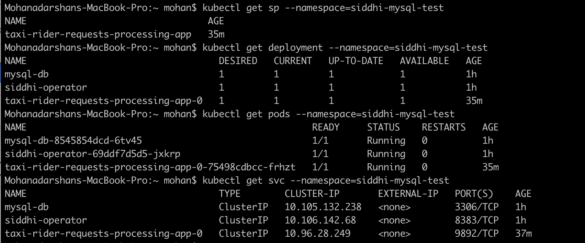
    
    - You can find the alert logs in the siddhi runner log file. To see the Siddhi runner log file, you can invoke below command.
        ```bash
        kubectl get pods
        ```
     
        Then, find the pod name of the siddhi app deployed. Then invoke below command,
        
        ```bash
        kubectl logs <siddhi-app-pod-name> -f
        ```
        
    - Then, you can set a port forwarding to the Siddhi TCP endpoint which allows you to connect from the Host with below command.
     
        ```bash
        kubectl port-forward svc/taxi-rider-requests-processing-app-0 9892:9892 --namespace=siddhi-mysql-test   
        ```
        
        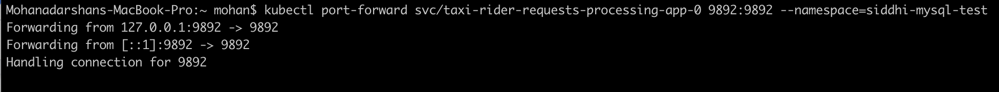
   
    - Then execute below command to send TCP events to Siddhi Stream Processor.
   
        ```bash
        java -jar tcp-producer-1.0.0-jar-with-dependencies.jar tcp://0.0.0.0:9892/taxiRideRequests
        ```     
     	
    - Then, you could see below logs get printed in the Siddhi runner console/log, events related to `NeedMoreRidersStream`  are stored in the database table and escalation email is sent to the manager when there is an increasing trend found in the cancellations.  

        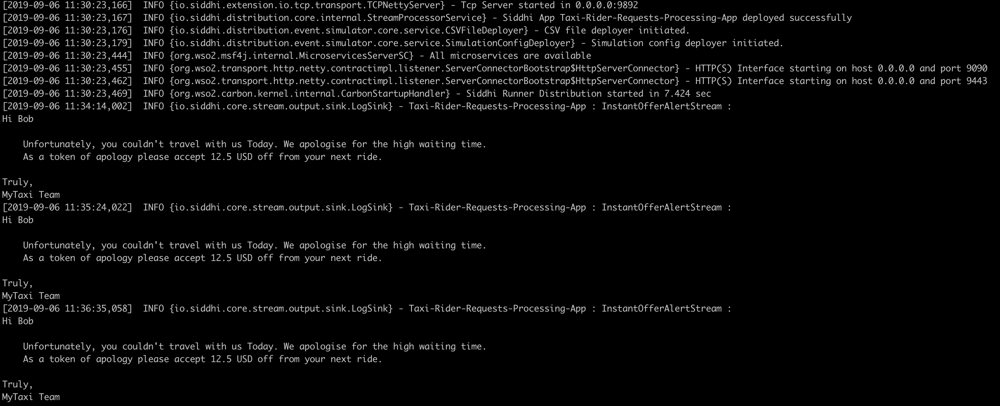
                
        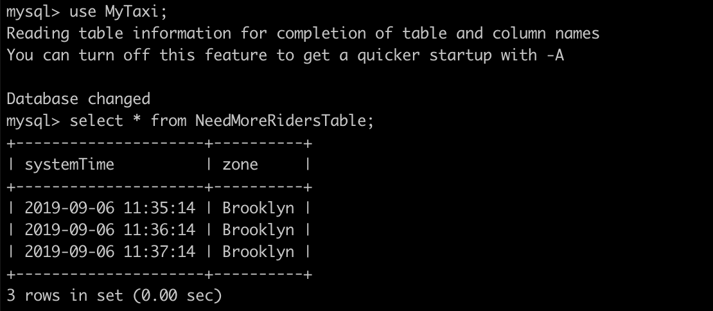
                
        
   
    !!! info "Refer [here](https://siddhi.io/en/v5.1/docs/siddhi-as-a-kubernetes-microservice/) to get more details about running Siddhi on Kubernetes."
       
