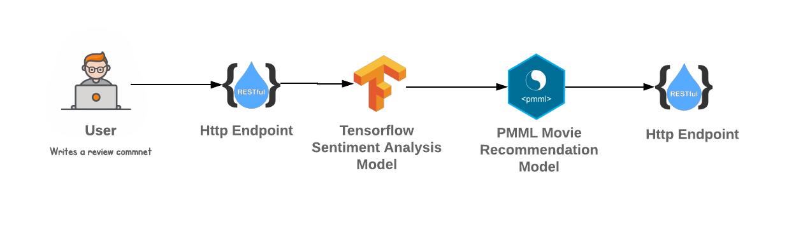
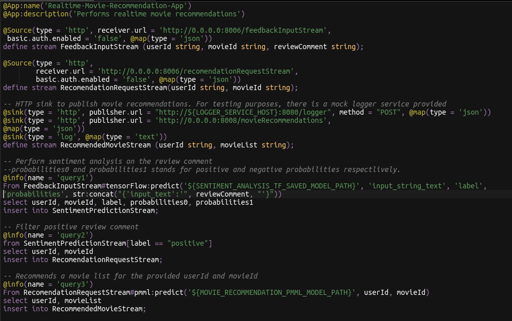
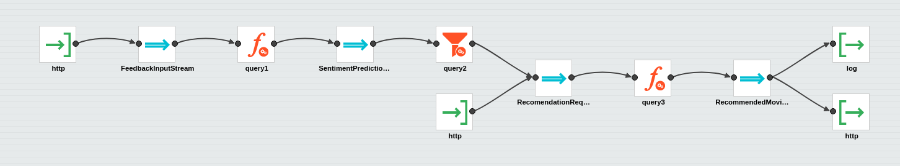
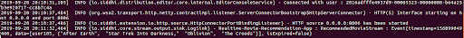
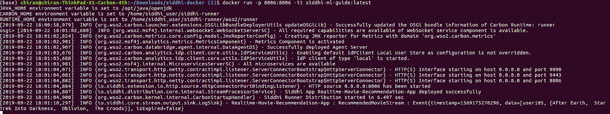
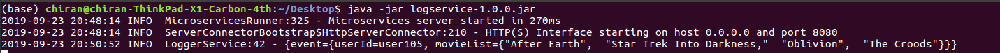
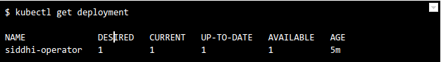
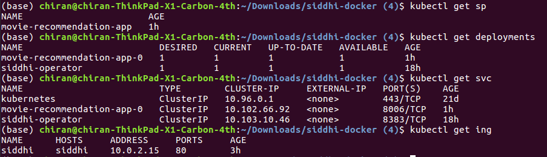

Realtime predictions with pre-trained ML models
================================================

In this guide, we are going to understand  how we can use Siddhi’s capability to perform real time predictions with a pre-trained machine learning models.

## Scenario - Predicting movie ratings
Recommendation systems that model users and their interests are often used to improve various user services. 
Such systems are usually based on automatic prediction of user ratings of the items provided by the service. 

Within this guide, we focus on using machine learning capabilities integrated with Siddhi to perform Sentiment Analysis 
and generate movie recommendations. 
We'll use a pretrained tensorflow model to predict whether a movie review is positive or negative using BERT in Tensorflow 
and then a PMML model trained with the MovieLense dataset to generate recommendations for a positively reviewed movie. 
 

The following sections are available in this guide.

* [What you'll build](#what-youll-build)
* [Prerequisites](#prerequisites)
* [Implementation](#implementation)
* [Testing](#testing)
* [Deployment & Output](#deployment)

## What you'll build

We are going to consider a real world use case of implementing a real time prediction requirement. 
This will help you to understand some Siddhi Stream Processing constructs and extensions such as filters, source, sinks, 
tensorflow, pmml extensions… Let’s jump in to the use case directly.

This guide demonstrates how we can build a recommendation system which recommends movies based on the user’s review comments. 
User would write a review comment on a movie and this review comment would be the initial input to the system. From the system, 
we would perform sentiment analysis using a pre-trained tensorflow model to binary classify the review comment as positive or negative.
If the user’s comment is positive, we pass the UserId and the MovieId as inputs to a pre-trained PMML model which then generates movie recommendations.



## Prerequisites
Below are the prerequisites that should be considered to implement the above use case.

### Mandatory Requirements
* [Siddhi tooling VM/Local distribution](https://siddhi.io/en/v5.1/download/)
* One of the [Siddhi runner distributions](https://siddhi.io/en/v5.1/download/) 
    - VM/Local Runtime
    - Docker Image
    - K8S Operator (commands are given in deployment section)
* Java 8 or higher
* [Siddhi Gpl Execution PMML extension](https://maven.wso2.org/nexus/service/local/repositories/releases/content/io/siddhi/extension/gpl/execution/pmml/siddhi-gpl-execution-pmml/5.0.1/siddhi-gpl-execution-pmml-5.0.1.jar)
* [Siddhi Execution Tensorflow extension](https://mvnrepository.com/artifact/io.siddhi.extension.execution.tensorflow/siddhi-execution-tensorflow/2.0.2) 
* [Pre-trained sentiment analysis tensorflow model](https://github.com/pcnfernando/MovieRecommendationSystem/tree/master/tf/SentimentAnalysisModel/bert)
* [Pre-trained movie recommendation PMML model](https://github.com/pcnfernando/MovieRecommendationSystem/tree/master/pmml/MovieRecommendationModel)

##### Training Tensorflow model for Sentiment Analysis
We use the IMDB dataset that contains the text of 50,000 movie reviews from the Internet Movie Database. 
These are split into 25,000 reviews for training and 25,000 reviews for testing. The training and testing sets are balanced, 
meaning they contain an equal number of positive and negative reviews.  We use this data to train a Tensorflow model. 

You can find the [Jupyter notebook](https://github.com/pcnfernando/IMDB_SentimentAnalysis/blob/master/tf/predicting_movie_reviews_with_bert_on_tf_hub.ipynb) used to train the tensorflow sentiment analysis model. 

#####  Training PMML model for movie recommendation
We use the MovieLens 1M Dataset that contain 1,000,209 anonymous ratings of approximately 3,900 movies for training the model. We use Scikit-Learn library to create the recommendation model and exports it using SkLearn2PMML to a PMML model.

You can find the [Jupyter notebook](https://github.com/codeheroku/Introduction-to-Machine-Learning/blob/master/Building%20a%20Movie%20Recommendation%20Engine/Movie_Recommendation_Engine.ipynb) used to train the movie recommendation model. 

### Requirements needed to deploy Siddhi in Docker/Kubernetes

* [Docker](https://docs.docker.com/engine/installation/)
* [Minikube](https://github.com/kubernetes/minikube#installation) or [Google Kubernetes Engine(GKE) Cluster](https://console.cloud.google.com/) or [Docker for Mac](https://docs.docker.com/docker-for-mac/install/)


## Implementation

Let’s assume the system sends a HTTP request upon user adding a review comment to a movie to endpoint /feedbackInputStream registered by Siddhi Runtime. 
This HTTP request would contain the UserId, MovieId and the ReviewComment. 

* Siddhi Runtime performs sentiment analysis on the received ReviewComment using a pre-trained tensorflow model.
* If the review comment is positive, then the MovieId and UserId are passed to a recommendation PMML model and it recommends few movies for the passed combination.
* This recommendation is then sent back as an HTTP request back to the system. 

The use case depends on two extensions namely Siddhi-gpl-execution-pmml and Siddhi-execution-tensorflow extensions that are not bundled to the Siddhi distributions by default.
Hence, these dependencies needs to be copied to the distribution before you start implementing the use case.

Copy siddhi-gpl-execution-pmml and siddhi-execution-tensorflow extensions to SIDDHI_TOOLING_HOME/bundles directory. 
Refer [Adding Extensions and Third Party Dependencies documentation](https://siddhi.io/en/v5.1/docs/config-guide/#adding-extensions-and-third-party-dependencies) for more details.

### Implement Streaming Queries

1. Start the [Siddhi tooling](https://siddhi.io/en/v5.0/docs/tooling/) runtime and go to the editor UI in http://localhost:9390/editor 

    Follow below steps to start the Siddhi tooling runtime.
    * Extract the downloaded zip and navigate to <TOOLING_HOME>/bin. (TOOLING_HOME refers to the extracted folder) 
    * Issue the following command in the command prompt (Windows) / terminal (Linux/Mac)
        ````
        For Windows: tooling.bat
        For Linux/Mac: ./tooling.sh
        ````

2. Select File -> New option, then you could either use the source view or design view to write/build the Siddhi Application. You can find the Siddhi Application bellow, that implements the requirements mentioned above.

3. Let’s write (develop) the Siddhi Application, as given below.

````sql
@App:name('Realtime-Movie-Recommendation-App')
@App:description('Performs realtime movie recommendations')

@Source(type = 'http', receiver.url = 'http://0.0.0.0:8006/feedbackInputStream',
 basic.auth.enabled = 'false', @map(type = 'json'))
define stream FeedbackInputStream (userId string, movieId string, reviewComment string);

@Source(type = 'http',
        receiver.url = 'http://0.0.0.0:8006/recomendationRequestStream',
        basic.auth.enabled = 'false', @map(type = 'json'))
define stream RecomendationRequestStream(userId string, movieId string);

-- HTTP sink to publish movie recommendations. For testing purposes, there is a mock logger service provided 
@sink(type = 'http', publisher.url = "http://${LOGGER_SERVICE_HOST}:8080/logger", method = "POST", @map(type = 'json'))
@sink(type = 'http', publisher.url = 'http://0.0.0.0:8008/movieRecommendations', 
@map(type = 'json'))
@sink(type = 'log', @map(type = 'text'))
define stream RecommendedMovieStream (userId string, movieList string);

-- Perform sentiment analysis on the review comment
--probabilities0 and probabilities1 stands for positive and negative probabilities respectlively.
@info(name = 'query1') 
From FeedbackInputStream#tensorFlow:predict('${SENTIMENT_ANALYSIS_TF_SAVED_MODEL_PATH}', 'input_string_text', 'label', 'probabilities', str:concat("{'input_text':'", reviewComment, "'}")) 
select userId, movieId, label, probabilities0, probabilities1
insert into SentimentPredictionStream;

-- Filter positive review comment
@info(name = 'query2') 
from SentimentPredictionStream[label == "positive"]
select userId, movieId
insert into RecomendationRequestStream;

-- Recommends a movie list for the provided userId and movieId
@info(name = 'query3') 
From RecomendationRequestStream#pmml:predict('${MOVIE_RECOMMENDATION_PMML_MODEL_PATH}', userId, movieId) 
select userId, movieList
insert into RecommendedMovieStream;


````

Source view of the Siddhi app.


Below is the flow diagram of the above Siddhi App.



4. Once the Siddhi app is created, you can use the Event Simulator option in the editor to simulate events to streams and perform developer testing.

## Testing

NOTE: In the provided Siddhi app, there are some environmental variables (SENTIMENT_ANALYSIS_TF_SAVED_MODEL_PATH, and MOVIE_RECOMMENDATION_PMML_MODEL_PATH) used which are the absolute paths for the pre-trained models. Again, there is a mock service configured to receive the recommended movies, and its host is configured via LOGGER_SERVICE_HOST environment property. Hence, make sure to set the environmental variables with the proper values in the system
        
 * SENTIMENT_ANALYSIS_TF_SAVED_MODEL_PATH: Absolute path to the pre-trained tensorflow saved model directory.
 * MOVIE_RECOMMENDATION_PMML_MODEL_PATH: Absolute path to the pre-trained PMML file.
 * LOGGER_SERVICE_HOST: IP address of the host where logger service is running. (eg: 'localhost')

When you run the Siddhi app in the editor, you will see below logs getting printed in the editor console.


- You could simply simulate some events directly into the stream and test your Siddhi app in the editor itself. 
- Then, you can also simulate some events through HTTP to test the application. The following sections explain how you can test the Siddhi app via HTTP using cURL. 

### Run Mock Logger service

In the provided Siddhi app, there is a HTTP sink configured to push output events to an HTTP endpoint. To verify that, please download the mock server [jar](https://github.com/pcnfernando/MovieRecommendationSystem/util/logservice-1.0.0.jar) and run that mock service by executing below command.

````
java -jar logservice-1.0.0.jar
````

### Invoking the Siddhi App

As mentioned in the previous steps, there is a service running in Siddhi side which is listening for events related to movie review comments. As per the Siddhi query that we wrote in the ‘Implementation’ section, respective service can be accessed via 'http://0.0.0.0:8006/feedbackInputStream'.

As per the app, if the review comment is positive, movies similar to the reviewed movie will be returned as recommendations.

````
curl -v -X POST -d \
'{"event": {"userId": "user105", "movieId": "avatar", "reviewComment": "Best movie experience of the last 30 years.."}}' \
"http://localhost:8006/feedbackInputStream" -H "Content-Type:application/json"
````

If you invoke, above cURL request then Siddhi would identify it as a positive feedback and recommends similar movies. In this guide, for simplicity we are just logging the movie recommendations as below. 

````
INFO {io.siddhi.core.stream.output.sink.LogSink} - Realtime-Movie-Recommendation-App : RecommendedMovieStream : Event{timestamp=1568785937271, data=[user105, {After Earth, Star Trek Into Darkness, Oblivion, The Croods}], isExpired=false}
````

## Deployment

Once you are done with the development, export the Siddhi app that you have developed with File -> Export File option.

You can deploy the Siddhi app using any of the methods listed below. 

NOTE: In the above provided Siddhi app, there are some environmental variables (SENTIMENT_ANALYSIS_TF_SAVED_MODEL_PATH and MOVIE_RECOMMENDATION_PMML_MODEL_PATH)  which are mandatory to be set for Siddhi application to execute. Again, there is a mock service configured to publish the movie recommendations. Please configure LOGGER_SERVICE_HOST environment property to point the host where mock service is running.
        
 * SENTIMENT_ANALYSIS_TF_SAVED_MODEL_PATH: Absolute path to the pre-trained tensorflow saved model directory.
 * MOVIE_RECOMMENDATION_PMML_MODEL_PATH: Absolute path to the pre-trained PMML file.
 * LOGGER_SERVICE_HOST: IP address of the host where logger service is running. (eg: 'localhost')

### Deploy on VM/ Bare Metal

1. Download the latest Siddhi Runner [distribution](https://github.com/siddhi-io/distribution/releases/download/v5.1.0-beta/siddhi-runner-5.1.0-beta.zip).
2. Unzip the `siddhi-runner-x.x.x.zip`.
3. Copy the downloaded [siddhi-gpl-execution-pmml](https://maven.wso2.org/nexus/service/local/repositories/releases/content/io/siddhi/extension/gpl/execution/pmml/siddhi-gpl-execution-pmml/5.0.1/siddhi-gpl-execution-pmml-5.0.1.jar) and [siddhi-execution-tensorflow](https://mvnrepository.com/artifact/io.siddhi.extension.execution.tensorflow/siddhi-execution-tensorflow/2.0.2) to SIDDHI_RUNNER_HOME/bundles directory.
4. Start Siddhi app with the runner config by executing the following commands from the distribution directory.
        
     ````
     Linux/Mac : ./bin/runner.sh -Dapps=<siddhi-file-path> -DSENTIMENT_ANALYSIS_TF_SAVED_MODEL_PATH=<sentiment-analysis-tf-model-path> -DMOVIE_RECOMMENDATION_PMML_MODEL_PATH=<movie-recommendation-pmml-model-path>

     Windows : bin\runner.bat -Dapps=<siddhi-file-path> -DSENTIMENT_ANALYSIS_TF_SAVED_MODEL_PATH=<sentiment-analysis-tf-model-path> -DMOVIE_RECOMMENDATION_PMML_MODEL_PATH=<movie-recommendation-pmml-model-path>

	 Eg: If exported siddhi app in Siddhi home directory,
           ./bin/runner.sh -Dapps=Realtime-Movie-Recommendation-App.siddhi
     ````
    
5. Download the mock [logging service](https://github.com/pcnfernando/MovieRecommendationSystem/util/logservice-1.0.0.jar) which is used to demonstrate the capability of Siddhi HTTP sink. Execute the below command to run the mock server.

	    java -jar logservice-1.0.0.jar

6. Invoke the service with below cURL request.

        curl -v -X POST -d \
        '{"event": {"userId": "user105", "movieId": "avatar", "reviewComment": "Best movie experience of the last 30 years.."}}' \
        "http://localhost:8006/feedbackInputStream" -H "Content-Type:application/json"

7. We can see the output log in the console as shown below. You could see there is an alert log printed as shown in the below image.

     

8. At the same time, you could also see the events received to HTTP mock service endpoint (started in step #5) via its log as below.

      

### Deploy on Docker

1. Create a folder locally on your host machine (eg: `/home/siddhi-apps`) and copy the Siddhi app into it.

2. Create a folder locally (eg: `/home/tf_model`) and copy the pretrained Sentiment Analysis tensorflow model in to it.

3. Create a folder locally (eg: `/home/pmml_model`) and copy the pretrained Movie Recommendation PMML model in to it.

4. Pull the latest Siddhi Runner image from [Siddhiio Docker Hub] (https://hub.docker.com/u/siddhiio).
    
    ````
    docker pull siddhiio/siddhi-runner-alpine:5.1.0-beta
    ````

5. Start SiddhiApp by executing the following docker command.

    ````
    docker run -it -p 8006:8006 -v /home/siddhi-apps:/apps -v /home/tf_model:/tf_model -v /home/pmml_model:/pmml_model -e SENTIMENT_ANALYSIS_TF_SAVED_MODEL_PATH=/tf_model -e MOVIE_RECOMMENDATION_PMML_MODEL_PATH=/pmml_model/movie-recommendation.pmml siddhiio/siddhi-runner-alpine:5.1.0-beta -Dapps=/apps/Realtime-Movie-Recommendation-App.siddhi

    ````

    NOTE: In the above provided Siddhi app, there are some environmental variables (SENTIMENT_ANALYSIS_TF_SAVED_MODEL_PATH and MOVIE_RECOMMENDATION_PMML_MODEL_PATH)  which are mandatory to be set for Siddhi application to execute. Again, there is a mock service configured to receive the recommended movies (instructions given below), and its host is configured via LOGGER_SERVICE_HOST environment property. 
    Hence, make sure to add proper values for the environmental variables in the above command.

4. Download the mock [logging service](https://github.com/pcnfernando/MovieRecommendationSystem/util/logservice-1.0.0.jar)  which is used to demonstrate the capability of SIddhi HTTP sink. Execute below command to run the mock server.

    ````
	    java -jar logservice-1.0.0.jar
	````

5. Send a POST request with the movie feedback to the endpoint.

    ````
        curl -v -X POST -d \
        '{"event": {"userId": "user105", "movieId": "avatar", "reviewComment": "Best movie experience of the last 30 years.."}}' \
        "http://localhost:8006/feedbackInputStream" -H "Content-Type:application/json"

    ````
        
6. Since you have started the docker in interactive mode you can see the output in its console as below. 
(If it is not started in the interactive mode then you can run `docker exec -it  <docker-container-id> sh` command, go into the container and check the log file in `home/siddhi_user/siddhi-runner/wso2/runner/logs/carbon.log` file)

    

7. At the same time, you could also see the events received to HTTP mock service endpoint (started in step #4) via its log as below.

    

### Deploy on Kubernetes
1. Install Siddhi Operator
    - To install the Siddhi Kubernetes operator run the following commands.
        
        ````
        kubectl apply -f https://github.com/siddhi-io/siddhi-operator/releases/download/v0.2.0-alpha/00-prereqs.yaml
        kubectl apply -f https://github.com/siddhi-io/siddhi-operator/releases/download/v0.2.0-alpha/01-siddhi-operator.yaml
        ````
        
     - You can verify the installation by making sure the following deployments are running in your Kubernetes cluster.
     
        


2. Download the mock [logging service](https://github.com/pcnfernando/MovieRecommendationSystem/util/logservice-1.0.0.jar) 
which is used to demonstrate the capability of Siddhi HTTP sink. Execute the below command to run the mock server.

    ````
        java -jar logservice-1.0.0.jar
    ````
    
3. Siddhi applications can be deployed on Kubernetes using the Siddhi operator.
    - Before deploying the apps you have to define an [Ingress](https://kubernetes.github.io/ingress-nginx/deploy/#provider-specific-steps), this is because there is an HTTP endpoint in the Siddhi app you have written and you will be sending events to that.
    
    - We need a custom docker image bundling the pretrained models to the container.
      ````yaml
      # use siddhi-runner-base
      FROM siddhiio/siddhi-runner-base-alpine:5.1.0-beta
      MAINTAINER Siddhi IO Docker Maintainers "siddhi-dev@googlegroups.com"
      
      ARG HOST_BUNDLES_DIR=./bundles
      ARG HOST_JARS_DIR=./jars
      ARG HOST_APPS_DIR=./siddhi-files
      ARG TRAINED_MODEL_DIR=./models
      ARG JARS=${RUNTIME_SERVER_HOME}/jars
      ARG BUNDLES=${RUNTIME_SERVER_HOME}/bundles
      ARG APPS=${RUNTIME_SERVER_HOME}/deployment/siddhi-files
      ARG CONFIG_FILE=./configurations.yaml
      ARG CONFIG_FILE_PATH=${HOME}/configurations.yaml
      
      # copy bundles & jars to the siddhi-runner distribution
      COPY --chown=siddhi_user:siddhi_io ${HOST_APPS_DIR}/ ${APPS}
      
      COPY --chown=siddhi_user:siddhi_io ${HOST_BUNDLES_DIR}/ ${BUNDLES}
      COPY --chown=siddhi_user:siddhi_io ${CONFIG_FILE}/ ${USER_HOME}
      COPY --chown=siddhi_user:siddhi_io ${TRAINED_MODEL_DIR}/ ${USER_HOME}
      
      # expose ports
      EXPOSE 9090 9443 9712 9612 7711 7611 7070 7443
      
      STOPSIGNAL SIGINT
      
      ENTRYPOINT ["/home/siddhi_user/siddhi-runner/bin/runner.sh"]

      ````

       To create the docker image, save the above content to a docker file and execute the below command.
	   `docker build <absolute-docker-file-path> -t siddhi-runner-mov-recommendation:1.0.0`
	   
    - To deploy the above created Siddhi app, you have to create a custom resource object YAML file (with the kind as SiddhiProcess) as following
    
        ````yaml
        apiVersion: siddhi.io/v1alpha2
        kind: SiddhiProcess
        metadata:
          name: movie-recommendation-app
        spec:
          apps:
           - script: |
            @App:name('Realtime-Movie-Recommendation-App')
        @App:description('Performs realtime movie recommendations')
        
        @Source(type = 'http', receiver.url = 'http://0.0.0.0:8006/feedbackInputStream',
         basic.auth.enabled = 'false', @map(type = 'json'))
        define stream FeedbackInputStream (userId string, movieId string, reviewComment string);
        
        @Source(type = 'http',
                receiver.url = 'http://0.0.0.0:8006/recomendationRequestStream',
                basic.auth.enabled = 'false', @map(type = 'json'))
        define stream RecomendationRequestStream(userId string, movieId string);
        
        -- HTTP sink to publish movie recommendations. For testing purposes, there is a mock logger service provided 
        @sink(type = 'http', publisher.url = "http://${LOGGER_SERVICE_HOST}:8080/logger", method = "POST", @map(type = 'json'))
        @sink(type = 'log', @map(type = 'text'))
        @sink(type = 'http', publisher.url = 'http://0.0.0.0:8008/movieRecommendations', 
        @map(type = 'json'))
        define stream RecommendedMovieStream (userId string, movieList string);
        
        -- Perform sentiment analysis on the review comment
        --probabilities0 and probabilities1 stands for positive and negative probabilities respectlively.
        @info(name = 'query1') 
        From FeedbackInputStream#tensorFlow:predict('${SENTIMENT_ANALYSIS_TF_SAVED_MODEL_PATH}', 'input_string_text', 'label', 'probabilities', str:concat("{'input_text':'", reviewComment, "'}")) 
        select userId, movieId, label, probabilities0, probabilities1
        insert into SentimentPredictionStream;
        
        -- Filter positive review comment
        @info(name = 'query2') 
        from SentimentPredictionStream[label == "positive"]
        select userId, movieId
        insert into RecomendationRequestStream;
        
        -- Recommends a movie list for the provided userId and movieId
        @info(name = 'query3') 
        From RecomendationRequestStream#pmml:predict('${MOVIE_RECOMMENDATION_PMML_MODEL_PATH}', userId, movieId) 
        select userId, movieList
        insert into RecommendedMovieStream;
        
          container:
            env:
              -
                name: LOGGER_SERVICE_HOST
                value: "10.100.1.88"
              -
                name: SENTIMENT_ANALYSIS_TF_SAVED_MODEL_PATH
                value: /home/siddhi_user/trained_models/tf
              -
                name: MOVIE_RECOMMENDATION_PMML_MODEL_PATH
                value: /home/siddhi_user/trained_models/pmml/movie-recommendation.pmml
        
            image: "siddhi-runner-mov-recommendation:1.0.0"

        ````
        
        NOTE: In the above provided Siddhi app, there are some environmental variables (SENTIMENT_ANALYSIS_TF_SAVED_MODEL_PATH and MOVIE_RECOMMENDATION_PMML_MODEL_PATH)  which are mandatory to be set for Siddhi application to execute. Again, there is a mock service configured to to receive the recommended movies (instructions given below), and its host is configured via LOGGER_SERVICE_HOST environment property. 
        Hence, make sure to add proper values for the environmental variables in the above YAML file (check the `env` section of the YAML file).
        
    - Now, let’s create the above resource in the Kubernetes cluster with the following command.
        
        ````    	
    	 kubectl create -f <absolute-yaml-file-path>/Movie-Recommendation-App.yaml
    	````
    
    - Once, Siddhi app is successfully deployed. You can verify its health using the following commands
        
        
        
    - Then, add the host `siddhi` and related external IP (ADDRESS) to the `/etc/hosts` file in your machine. For Docker for Mac , external IP is `0.0.0.0`. For Minikube, you have to use Minikube IP as the external IP. Hence, run minikube ip command to get the IP of the Minikube cluster.
    
    - You can find the recommendations logged in the Siddhi runner log file. To see the Siddhi runner log file, first, invoke below command to get the pods.
        
        ````
        kubectl get pods
        ````
    
        Then, find the pod name of the Siddhi app deployed, and invoke below command to view the logs.
        
        ````
        kubectl logs -f <siddhi-app-pod-name>
        ````
        
        Eg: as shown below image,
            
         

    - Pass the movie review along with the userId and the movieId as a CURL request.
      
        ````
        curl -v -X POST -d \
        '{"event": {"userId": "user105", "movieId": "avatar", "reviewComment": "Best movie experience of the last 30 years.."}}' \
        "http://siddhi/movie-recommendation-app-0/8006/feedbackInputStream" -H "Content-Type:application/json"
        ````
          
    - Then, we could see the movie recommendations as console logs (as given below).
    
        
    
    - At the same time, you could see the events received to HTTP mock endpoint that started in the step [2].
    
        
   
    
    !!! info "Refer [here](https://siddhi.io/en/v5.1/docs/siddhi-as-a-kubernetes-microservice/) to get more details about running Siddhi on Kubernetes."
   
